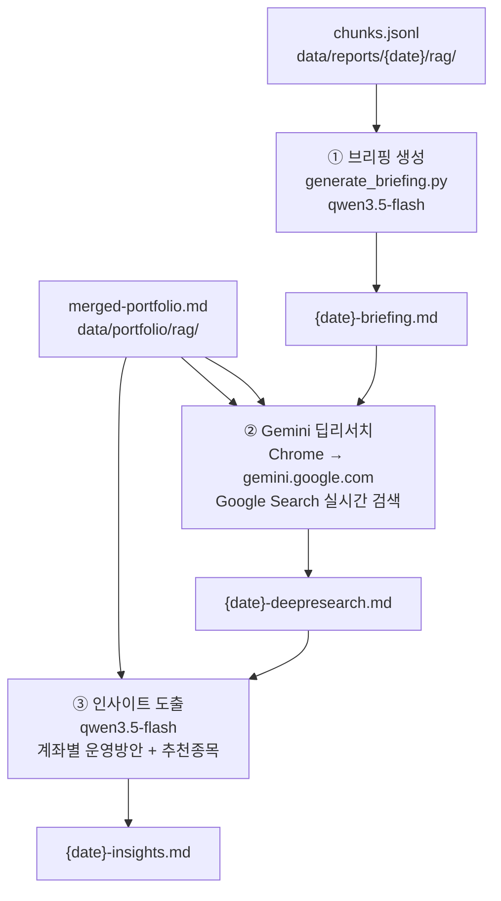
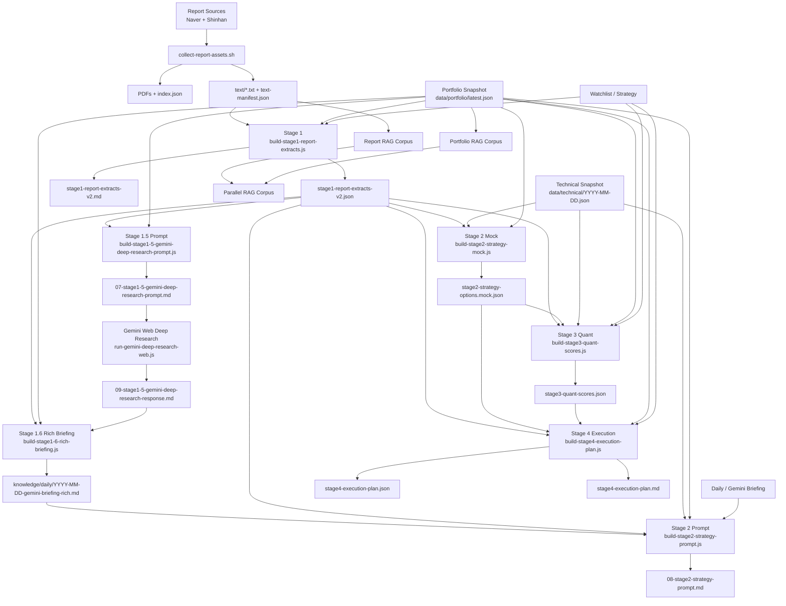

# EcoReport

EcoReport는 Mac Mini에서 돌아가는 반자동 포트폴리오 인텔리전스 워크벤치입니다.

핵심 목표는 하나입니다.

- 리포트를 많이 모으는 것이 아니라
- 리포트, 기술지표, 내 계좌 상태를 같은 구조 안에 넣고
- 실제 계좌 운용 지침까지 연결하는 것

현재 기본 모드는 **API 대량 호출형**이 아니라 **수동 LLM 개입형**입니다.
즉, EcoReport가 재료와 점수를 준비하고, ChatGPT/Gemini/Claude 같은 LLM은 해석과 전략 탐색을 담당합니다.

## 현재 목표

- ISA / 연금저축 / 토스증권 계좌를 하나의 모델로 다루기
- 증권사 PDF를 단순 요약이 아니라 연구 노트 형태로 축적하기
- 기술지표와 리포트 영향을 같이 반영한 계좌 점수 만들기
- 최종적으로 "오늘 뭘 보강/보류/관망할지"를 계좌 단위로 제시하기

## 핵심 원칙

- `igzun-daily-report`는 참고 레퍼런스일 뿐, EcoReport 런타임 의존성이 아닙니다.
- 수집 후에는 반드시 `PDF 전문 텍스트화`를 거칩니다.
- Stage 2만 LLM 의존도가 높고, Stage 1/3/4는 재현 가능한 코드로 유지합니다.
- 지금은 수동 LLM 운영이 기본이며, 구조가 안정되면 그때 API를 붙입니다.

## LLM 브리핑 + 딥리서치 파이프라인 (2026-04 현재)

증권사 리포트 청크 → Qwen 브리핑 → Gemini 딥리서치 → 인사이트 도출의 4단계 자동 파이프라인입니다.



### 역할 분담
| 단계 | 담당 | 이유 |
|------|------|------|
| 브리핑 (대용량 청크 → 요약) | **qwen3.5-flash** | 저렴, 컨텍스트 길어도 안정적 |
| 딥리서치 (실시간 검색 포함) | **Gemini 웹 Deep Research** | Google 검색 품질 최고, 무료 |
| 인사이트 도출 (요약 → 액션) | **qwen3.5-flash** | 저렴, Gemini 결과 재처리 |

### 실행 명령

```bash
cd /Users/seo/Documents/Playground/EcoReport
DATE=$(date +%F)

# ① 브리핑 생성 (qwen3.5-flash)
.venv/bin/python3 scripts/generate_briefing.py \
  --input data/reports/$DATE/rag/chunks.jsonl \
  --output knowledge/daily/$DATE-briefing.md \
  --model qwen3.5-flash \
  --max-chunks 80 --min-chunks 60 \
  --run-date $DATE --effective-market-date $DATE

# ② Gemini 웹 딥리서치 (Chrome 자동화 또는 수동)
#    브리핑 + 포트폴리오를 Gemini Deep Research에 입력

# ③ 인사이트 도출 (qwen3.5-flash, 딥리서치 결과 입력 후)
```

### Gemini 딥리서치 전용 브리핑 (레거시 / 수동)

`generate_gemini_briefing_deepresearch.py`는 `google-genai` SDK를 직접 사용하는 구버전입니다.
Gemini API 한도가 있을 때 또는 웹 딥리서치 프롬프트 소재로 활용합니다.

```bash
.venv/bin/python3 scripts/generate_gemini_briefing_deepresearch.py \
  --input data/reports/$DATE/rag/chunks.jsonl \
  --output knowledge/daily/$DATE-gemini-briefing.md
```

---

## 아키텍처 (전체)



별도 아키텍처 문서:

- [DOCS_MAP.md](docs/DOCS_MAP.md)
- [MULTI_TOOL_HANDOFF.md](docs/MULTI_TOOL_HANDOFF.md)
- [EXPERIMENT_PLAYBOOK.md](docs/EXPERIMENT_PLAYBOOK.md)
- [STAGE_1_4_ARCHITECTURE.md](docs/STAGE_1_4_ARCHITECTURE.md)
- [OPERATOR_RUNBOOK.md](docs/OPERATOR_RUNBOOK.md)
- [SCORE_SYSTEM_V2.md](docs/SCORE_SYSTEM_V2.md)
- [PRIVATE_ACCESS_RUNBOOK.md](docs/PRIVATE_ACCESS_RUNBOOK.md)
- [FAILURES_AND_FALLBACKS.md](FAILURES_AND_FALLBACKS.md)
- [UPDATE_LOG.md](docs/UPDATE_LOG.md)

## 문서 읽는 순서

여러 코딩 프로그램이나 다른 담당자가 이어받을 수 있게 문서를 역할별로 나눴습니다.

- 처음 들어오면: `README.md`
- 어떤 문서를 읽어야 할지 모르겠으면: `docs/DOCS_MAP.md`
- 여러 툴이 번갈아 작업하면: `docs/MULTI_TOOL_HANDOFF.md`
- 실제 실행/운영은: `docs/OPERATOR_RUNBOOK.md`
- 실험/검증/회귀 테스트는: `docs/EXPERIMENT_PLAYBOOK.md`
- 실패 원인과 폴백은: `FAILURES_AND_FALLBACKS.md`
- 최근 변경 이력은: `docs/UPDATE_LOG.md`

## 매일 운영 명령

가장 권장하는 일일 실행 방법은 아래 한 줄입니다.

```bash
cd /Users/seo/Documents/Playground/EcoReport
bash scripts/run-daily-system.sh --date YYYY-MM-DD
```

Gemini Deep Research 오버레이까지 포함한 완결형 자동 실행은 아래 명령을 사용합니다.

```bash
cd /Users/seo/Documents/Playground/EcoReport
npm run automation:daily -- --date YYYY-MM-DD
```

이 러너는 다음을 한 번에 묶습니다.

1. 리포트 수집 + 전문 텍스트화
2. 시장 데이터 수집 + 기술 점수 계산
3. 리포트/포트폴리오/병렬 RAG 재생성
4. Gemini 경제 브리핑 생성(키가 있을 때)
5. Stage 1~4 실행
6. `knowledge/wiki/` 지속형 투자 위키 갱신
7. `data` 브랜치 동기화
8. 일일 시스템 검증 리포트 생성

검증 결과는 아래에 저장됩니다.

- `data/analysis-state/YYYY-MM-DD/system-health.json`
- `knowledge/daily/YYYY-MM-DD-system-health.md`
- `data/analysis-state/YYYY-MM-DD/automation-cycle.json`
- `knowledge/daily/YYYY-MM-DD-automation-cycle.md`

포트폴리오가 한국투자증권 Open API와 연결되어 있다면, 일일 러너는 시작 전에
`data/portfolio/latest.json`에 KIS 계좌 스냅샷을 먼저 반영합니다.

수동으로만 먼저 갱신하고 싶을 때는 아래 명령을 사용합니다.

```bash
cd /Users/seo/Documents/Playground/EcoReport
npm run portfolio:sync:kis -- --date YYYY-MM-DD
```

Shadow 파이프라인만 따로 확인하고 싶을 때는 아래 명령을 사용합니다.

```bash
cd /Users/seo/Documents/Playground/EcoReport
npm run shadow:pipeline -- --date YYYY-MM-DD
```

이 러너는 아래 4단계를 묶습니다.

1. `build-report-chunk-index.js`
2. `build-stage1-shadow-extracts.js`
3. `build-stage2-shadow-topic-buckets.js`
4. `build-stage3-shadow-final-insights.js`

출력은 기존 legacy 경로와 canonical mirror 경로에 같이 남습니다.

- legacy 예시:
  - `data/analysis-state/YYYY-MM-DD/chunk-index/*`
  - `data/analysis-state/YYYY-MM-DD/stage1-shadow/*`
  - `data/analysis-state/YYYY-MM-DD/stage2-shadow-topic-buckets.json`
  - `data/analysis-state/YYYY-MM-DD/stage3-shadow-final-insights.json`
- canonical mirror 예시:
  - `data/analysis-state/YYYY-MM-DD/shadow/stage0/*`
  - `data/analysis-state/YYYY-MM-DD/shadow/stage1/*`
  - `data/analysis-state/YYYY-MM-DD/shadow/stage2/*`
  - `data/analysis-state/YYYY-MM-DD/shadow/stage3/*`

계좌 매핑은 `config/portfolio-sync.json`에서 관리합니다.

자동 실행 전제:

- Mac이 잠겨 있지 않아야 합니다.
- Safari가 Gemini에 로그인된 상태여야 합니다.
- Deep Research 단계가 실패해도 baseline 리포트와 실패 요약은 남도록 설계합니다.

## LLM Wiki Layer

EcoReport는 이제 일일 산출물을 `persistent wiki`로 다시 컴파일합니다.

- 입력: `data/`, `knowledge/daily/`, `reports/daily/`
- 지속형 메모리: `knowledge/wiki/`
- 목적: 같은 리포트를 반복해서 다시 읽지 않고, 계좌/종목 thesis를 누적하는 것

핵심 명령:

```bash
cd /Users/seo/Documents/Playground/EcoReport
node scripts/build-llm-wiki.js --date YYYY-MM-DD
node scripts/publish-llm-wiki-to-vault.js
```

생성물:

- `knowledge/wiki/index.md`
- `knowledge/wiki/log.md`
- `knowledge/wiki/overview.md`
- `knowledge/wiki/daily/YYYY-MM-DD.md`
- `knowledge/wiki/accounts/*.md`
- `knowledge/wiki/securities/*.md`

Obsidian에서 바로 보려면 publish 결과도 같이 봅니다.

- vault 기본 위치: `/Users/seo/my-wiki`
- publish 위치: `/Users/seo/my-wiki/wiki/ecoreport`
- raw context 위치: `/Users/seo/my-wiki/raw/ecoreport`

이 레이어는 단순 기록용이 아니라, 실제 자본 배치에 도움이 되는 질문에 빠르게 답하기 위해 존재합니다.

- 오늘 새 돈을 어디에 넣어야 하는가
- 어떤 보유 자산의 thesis가 약해졌는가
- 며칠째 반복해서 살아남는 후보는 무엇인가

자세한 운영 개념은 [LLM_WIKI_SYSTEM.md](docs/LLM_WIKI_SYSTEM.md)를 참고합니다.

## 접속 방식

기본 운영은 이제 **공개 배포보다 로컬 우선**입니다.

- 기본: Mac Mini 로컬 실행 + private access
- 선택: `data` 브랜치/Vercel 보조 대시보드

Vercel preview 실패가 있어도 일일 운영은 막히지 않도록 설계합니다.
공개 배포가 불안정할 때는 Tailscale 같은 tailnet 기반 접속을 권장합니다.

### 현재 권장 접속 경로

개발/검증 중에는 아래를 기준으로 봅니다.

```bash
cd /Users/seo/Documents/Playground/EcoReport/dashboard
npm run dev -- --hostname 0.0.0.0
```

그다음 같은 Mac Mini에서는:

- [http://localhost:3000](http://localhost:3000)

같은 와이파이 기기에서는:

- `http://<Mac-Mini-LAN-IP>:3000`

로 접속합니다.

즉, **지금 기준의 진짜 소스 오브 트루스는 `localhost:3000`** 입니다.

운영 가이드는 아래 문서를 따릅니다.

- [PRIVATE_ACCESS_RUNBOOK.md](docs/PRIVATE_ACCESS_RUNBOOK.md)
- [VERCEL_DEPLOY_RUNBOOK.md](docs/VERCEL_DEPLOY_RUNBOOK.md)
- [UPDATE_LOG.md](docs/UPDATE_LOG.md)
- [FAILURES_AND_FALLBACKS.md](FAILURES_AND_FALLBACKS.md)

### 대시보드 로컬 키 설정

로컬 대시보드에서 OCR과 GitHub 동기화를 자동으로 쓰려면 아래 파일을 채웁니다.

```bash
cd /Users/seo/Documents/Playground/EcoReport/dashboard
cp .env.local.example .env.local
```

그다음 `dashboard/.env.local`에 값을 넣습니다.

```bash
GEMINI_API_KEY=...
GEMINI_PORTFOLIO_MODEL=gemini-2.5-flash
GITHUB_TOKEN=...
```

동작 방식:

- `GEMINI_API_KEY`: `/portfolio/update`의 이미지 OCR, 일괄 분류, 숫자 추출
- `GITHUB_TOKEN`: 포트폴리오 저장 시 `main` 자동 동기화, 수동 LLM 저장 동기화, 대시보드의 분석 실행 버튼에서 GitHub `repository_dispatch` 호출

즉 `GITHUB_TOKEN`이 들어가 있으면 `/portfolio/update`에서 저장할 때 로컬 파일 저장 후 GitHub `main`에도 자동 반영됩니다.

권한 메모:

- 고전형 PAT를 쓴다면 보통 `repo` 권한이면 충분합니다.
- fine-grained PAT를 쓴다면 이 저장소 기준 `Contents: write`가 필요합니다.

## Stage 1~4 개요

### Stage 1. 리포트 연구 노트화

입력:

- `data/reports/YYYY-MM-DD/index.json`
- `data/reports/YYYY-MM-DD/text/*.txt`
- `data/portfolio/latest.json`
- `config/watchlist.json`

출력:

- `data/analysis-state/YYYY-MM-DD/stage1-report-extracts-v2.json`
- `knowledge/daily/YYYY-MM-DD-stage1-report-extracts-v2.md`

핵심 필드:

- `report_type`
- `sector`
- `themes`
- `related_holdings_in_my_portfolio`
- `related_accounts`
- `key_thesis`
- `key_points`
- `key_numbers`
- `what_changed`
- `bull_case`
- `bear_case`
- `portfolio_impacts_candidate`
- `evidence_notes`

설명:

- 이 단계는 추천을 만드는 단계가 아니라 **리포트 연구 노트를 만드는 단계**입니다.
- 최대한 많은 근거를 보존하고, 리포트-포트폴리오 관련성을 후보 수준으로 붙입니다.

### Stage 1.5. Gemini Deep Research 수동 연동

입력:

- `data/analysis-state/YYYY-MM-DD/stage1-report-extracts-v2.json`
- `data/portfolio/latest.json`

출력:

- `knowledge/daily/manual-kit/YYYY-MM-DD/07-stage1-5-gemini-deep-research-prompt.md`
- `knowledge/daily/manual-kit/YYYY-MM-DD/09-stage1-5-gemini-deep-research-response.md`

설명:

- Stage 1 구조화 추출물과 최신 포트폴리오를 Gemini Web Deep Research용 프롬프트로 묶습니다.
- Safari에서 Gemini 웹을 열고 `도구 -> Deep Research` 선택, 전송, 결과 저장/클립보드 복사까지 자동화할 수 있습니다.
- 이 단계는 완전 자동 API 호출이 아니라 웹 기반 수동 리서치를 파이프라인 안에 안전하게 끼워 넣는 레이어입니다.

### Stage 1.6. 최종 Rich Briefing 합성

입력:

- Stage 1 연구 노트
- Stage 1.5 Gemini Deep Research 결과
- 기존 어드바이저 브리핑
- 포트폴리오 상태

출력:

- `knowledge/daily/YYYY-MM-DD-gemini-briefing-rich.md`
- `knowledge/daily/YYYY-MM-DD-gemini-briefing-rich.md.meta.json`
- `knowledge/daily/manual-kit/YYYY-MM-DD/10-stage1-6-final-research-briefing.md`

설명:

- Stage 1의 사실 근거와 Deep Research의 시나리오/대안 자산/촉매 해석을 다시 조합해 대시보드용 최종 매크로 브리핑을 만듭니다.
- 대시보드의 `Macro View`는 이 rich briefing을 우선 읽습니다.

### Stage 2. 전략 탐색

입력:

- Stage 1 연구 노트
- 포트폴리오 상태
- 기술지표
- Daily / Gemini 브리핑

출력:

- `knowledge/daily/manual-kit/YYYY-MM-DD/08-stage2-strategy-prompt.md`
- `data/analysis-state/YYYY-MM-DD/stage2-strategy-options.mock.json`
- `data/analysis-state/YYYY-MM-DD/stage2-strategy-options.json`

설명:

- 실제 LLM이 붙을 자리입니다.
- 현재는 mock JSON을 먼저 만들어 Stage 3/4를 계속 검증합니다.
- 나중에는 이 mock 자리에 실제 LLM 응답 JSON이 들어갑니다.

### Stage 3. 퀀트 점수화

입력:

- 기술지표
- `impact-map.json` (있으면 우선 사용, 없으면 Stage 1 리포트 영향 후보 fallback)
- Stage 2 전략 bias
- 전략 파일 / 목표 배분

출력:

- `data/analysis-state/YYYY-MM-DD/stage3-quant-scores.json`

설명:

- 종목, 계좌, 포트폴리오 점수를 계산합니다.
- 현재 Stage 3는 `교차단면 팩터 점수 + coverage-aware base score - 리스크 패널티 + tax-aware 조정` 구조입니다.
- BaseScore는 `배분 + 팩터 + 기술 + 리포트 + 레짐 적합도 + Stage 2 점수 + 선행지표`를 coverage-aware 가중치로 합성합니다.
- 팩터 점수는 `모멘텀 / 리서치 강도 / 인컴 수익률 / 레짐 적합도`를 Z-score 정규화 후 bounded score로 변환합니다.
- RiskPenalty는 `데이터 품질 + 집중도 + 축소 공분산 기반 변동성 + 레짐 스트레스 + tail risk`를 별도 감점으로 관리합니다.
- 계좌별 최종 점수는 예상 인컴 수익률과 계좌 세율 가정을 사용해 tax-aware multiplier로 한 번 더 보정합니다.
- 대시보드는 이 파일의 `baseScores`, `effectiveWeights`, `riskPenalty`를 읽어 “왜 이 점수인지 / 뭘 하면 점수가 올라가는지”를 설명합니다.

### Stage 4. 실행 계획 생성

입력:

- Stage 1 연구 노트
- Stage 2 전략 탐색 결과
- Stage 3 점수
- 포트폴리오 현재 상태

출력:

- `data/analysis-state/YYYY-MM-DD/stage4-execution-plan.json`
- `reports/daily/YYYY-MM-DD-stage4-execution-plan.md`
- `reports/daily/YYYY-MM-DD-briefing.md`

설명:

- 계좌별 부족 자산군
- 이번 tranche 투입 예산
- 즉시 보강 후보
- 유지/감축/관찰 대상
- 직접 관련 리포트 근거

를 하나의 실행 초안으로 만듭니다.

## 디렉토리 구조

```text
EcoReport/
├── config/                    # 전략, 관심종목, RSS 피드, 알림 규칙
├── dashboard/                 # Next.js 대시보드
├── data/
│   ├── analysis-state/        # Stage 1~4 산출물
│   ├── market/                # 날짜별 시장 데이터
│   ├── news/                  # 날짜별 RSS 뉴스
│   ├── portfolio/             # 최신 계좌 스냅샷
│   ├── reports/               # 날짜별 PDF/텍스트/RAG/수동 요약
│   ├── technical/             # 날짜별 기술 점수
│   └── tweets/                # 날짜별 트윗 결과
├── docs/                      # 아키텍처 및 운영 문서
├── knowledge/
│   ├── daily/                 # prompt, response, manual-kit
│   ├── monthly/
│   ├── rag/                   # 병렬 RAG 코퍼스
│   └── weekly/
├── reports/
│   └── daily/                 # stage4 실행계획, briefing
└── scripts/                   # 수집/정리/점수/실행 스크립트
```

## 수집 이후 텍스트화 원칙

리포트 수집은 **PDF 다운로드에서 끝나지 않습니다.**

반드시 아래 산출물이 같이 있어야 합니다.

- `data/reports/YYYY-MM-DD/index.json`
- `data/reports/YYYY-MM-DD/text/*.txt`
- `data/reports/YYYY-MM-DD/crawl-manifest.json`
- `data/reports/YYYY-MM-DD/text-manifest.json`

즉, 앞으로 EcoReport의 1번 시작 단계는:

1. PDF 수집
2. 전문 텍스트 추출
3. OCR fallback
4. 텍스트 품질 로그 생성

입니다.

## 핵심 데이터 스키마

### 포트폴리오 스냅샷

파일:

- `data/portfolio/latest.json`

용도:

- 계좌별 평가금액, 예수금, 보유 종목, 종목별 손익/수익률 저장
- 대시보드와 Stage 1~4 전체의 기준 데이터

### 기술 점수

파일:

- `data/technical/YYYY-MM-DD.json`

현재 포함:

- 이동평균선(5/20/60/120)
- RSI
- MACD
- 볼린저밴드
- 스토캐스틱
- ADX
- 거래량 비율

### 리포트 원본 자산

파일:

- `data/reports/YYYY-MM-DD/index.json`
- `data/reports/YYYY-MM-DD/text/*.txt`
- `data/reports/YYYY-MM-DD/crawl-manifest.json`
- `data/reports/YYYY-MM-DD/text-manifest.json`

### 수동 PDF 요약

파일:

- `data/reports/YYYY-MM-DD/manual-compressed.json`

용도:

- 수동 LLM이 읽은 개별 PDF 결과 저장
- 이후 synthesis/advisory 입력으로 사용

### RAG 코퍼스

파일:

- `data/reports/YYYY-MM-DD/rag/*`
- `data/portfolio/rag/YYYY-MM-DD/*`
- `knowledge/rag/YYYY-MM-DD/*`

용도:

- 리포트 원문 청크
- 포트폴리오 청크
- 병렬 검색 / 컨텍스트 빌더

## 현재 운영 모드

### 1. 자동 수집 + 수동 LLM 해석

기본 모드입니다.

- 수집, 텍스트화, 점수 계산은 코드가 수행
- 전략 해석은 사람이 ChatGPT/Gemini/Claude에 질문
- 응답은 수동 저장 또는 후속 자동 저장 스크립트로 반영

### 2. Stage 1~4 코드 검증 모드

실제 LLM이 없어도 mock Stage 2로 Stage 3/4를 검증할 수 있습니다.

이 모드가 중요한 이유:

- 구조가 먼저 안정되어야 나중에 API를 붙일 수 있음
- 점수와 실행계획이 재현 가능해야 사람/에이전트 교체가 가능함

## 실제 실행 명령

### 1. 리포트 수집 + 텍스트화

```bash
cd /Users/seo/stock-pilot
bash scripts/collect-report-assets.sh --date 2026-04-03
```

### 2. RAG 코퍼스 생성

```bash
cd /Users/seo/stock-pilot
node scripts/build-report-rag-corpus.js --date 2026-04-03
node scripts/build-portfolio-rag-corpus.js --date 2026-04-03
node scripts/build-parallel-rag-corpus.js --date 2026-04-03
```

### 3. Stage 1~6 + 전략 파이프라인 실행

```bash
cd /Users/seo/stock-pilot
npm run stage1.5:prompt -- --date 2026-04-03
npm run stage1.5:gemini:run -- --date 2026-04-03
npm run stage1.6:briefing -- --date 2026-04-03 --run-date 2026-04-03 --effective-market-date 2026-04-03
bash scripts/run-strategy-pipeline.sh --date 2026-04-03 --run-date 2026-04-03 --effective-market-date 2026-04-03 --gemini-stage2
```

또는 개별 실행:

```bash
cd /Users/seo/stock-pilot
npm run stage1:extracts -- --date 2026-04-03
npm run stage1.5:prompt -- --date 2026-04-03
npm run stage1.5:gemini:web -- --date 2026-04-03
npm run stage1.5:gemini:run -- --date 2026-04-03 --poll-sec 30 --timeout-sec 1800
npm run stage1.6:briefing -- --date 2026-04-03
npm run stage2:prompt -- --date 2026-04-03
npm run stage2:mock -- --date 2026-04-03
npm run stage3:quant -- --date 2026-04-03
npm run stage4:plan -- --date 2026-04-03
```

Gemini Deep Research 자동화는 기존 탭을 재사용하지 않고 항상 새 Safari 창을 열어 진행합니다.

핵심 산출물:

- `knowledge/daily/manual-kit/YYYY-MM-DD/07-stage1-5-gemini-deep-research-prompt.md`
- `knowledge/daily/manual-kit/YYYY-MM-DD/09-stage1-5-gemini-deep-research-response.md`
- `knowledge/daily/YYYY-MM-DD-gemini-briefing-rich.md`
- `data/analysis-state/YYYY-MM-DD/stage2-strategy-options.json`
- `reports/daily/YYYY-MM-DD-briefing.md`

### 4. 수동 프롬프트 브리핑

```bash
bash scripts/open-chatgpt-web-prompt.sh advisory
bash scripts/open-chatgpt-web-prompt.sh synthesis
bash scripts/open-chatgpt-web-prompt.sh triage
```

### 5. 개별 수동 프롬프트

```bash
bash scripts/open-chatgpt-web-prompt.sh synthesis
bash scripts/open-chatgpt-web-prompt.sh coach
bash scripts/open-chatgpt-web-prompt.sh advisory
bash scripts/open-chatgpt-web-prompt.sh ideas
```

## 다른 날짜 / 다른 사람 / 다른 에이전트가 이어받는 순서

1. 이 README 읽기
2. [DOCS_MAP.md](docs/DOCS_MAP.md) 읽기
3. [MULTI_TOOL_HANDOFF.md](docs/MULTI_TOOL_HANDOFF.md) 읽기
4. [OPERATOR_RUNBOOK.md](docs/OPERATOR_RUNBOOK.md) 읽기
5. 실험/검증이면 [EXPERIMENT_PLAYBOOK.md](docs/EXPERIMENT_PLAYBOOK.md) 읽기
6. 해당 날짜의 아래 파일 존재 여부 확인
   - `data/reports/YYYY-MM-DD/index.json`
   - `data/reports/YYYY-MM-DD/text-manifest.json`
   - `data/analysis-state/YYYY-MM-DD/automation-cycle.json`
   - `data/analysis-state/YYYY-MM-DD/system-health.json`
   - `data/portfolio/latest.json`
7. 없으면 수집부터, 있으면 `run-strategy-pipeline.sh` 또는 `automation:daily`부터 시작

## 현재 잘 되는 것

- 네이버/신한 리포트 수집
- 수집 후 전문 텍스트화 + OCR fallback
- 리포트/포트폴리오 RAG 코퍼스 생성
- 기술지표 계산
- Stage 1~4 전략 파이프라인 산출물 생성
- 계좌 스냅샷 저장
- 로컬 대시보드 표시
- 경제 리포트 요약 + 어드바이저 브리핑 동시 표시
- 계좌별 점수 근거 / 개선 액션 표시
- ETF + 개별주 추천 보드 표시

## 아직 부족한 것

### 1. 리포트-계좌 양방향성

가장 큰 약점입니다.

현재 `portfolio_impacts_candidate`는 후보 수준입니다.
즉, 아직 확정된 영향도 레이어는 아닙니다.

다음 단계 핵심은 `impact-map.json`입니다.

### 2. Stage 2 Gemini 자동 실행

`GEMINI_API_KEY`가 `.env`에 있으면 `run-daily-system.sh`가 자동으로 `build-stage2-strategy-gemini.py`를 실행합니다.
키가 없으면 mock JSON으로 Stage 3/4를 계속 검증합니다.
수동으로 LLM에 묻고 싶다면 `open-chatgpt-web-prompt.sh` 또는 `knowledge/daily/manual-kit/` 프롬프트를 활용합니다.
Python 가상환경에는 `google-genai`가 설치되어 있어야 하며, 현재 Gemini Python 스크립트는 이 SDK 기준으로 동작합니다. 새 환경이면 `./.venv/bin/pip install google-genai`를 한 번 실행해 주세요.

### 3. Stage 1 품질 고도화

현재도 연구 노트는 생성되지만, 아래는 더 개선해야 합니다.

- 표/차트 잡음 제거
- 면책문구 제거 강화
- ETF/테마형 종목의 직접 관련성 추론 정교화
- `what_changed`의 변화 감지 정밀도

### 4. 딥 리서치 기반 점수 고도화

향후 목표:

- Direction
- Timing
- Regime
- ActionScore
- Conviction
- P(buy) / P(hold) / P(sell)

### 5. OCR 자동화

현재 포트폴리오 입력은 수동 검수형입니다.
다음 단계는 계좌 캡처 이미지를 넣으면:

- 종목명
- 수량
- 평가금액
- 예수금

을 자동 채우는 것입니다.

### 6. 외부 공개 배포 안정성

`Vercel`은 현재 보조 채널입니다.

- 운영 기준은 `localhost:3000`
- `data` 브랜치와 원격 배포는 참고/보조 용도
- Mac Mini 로컬 배포는 계속 반영
- `Vercel` 배포는 수동 실행, `repository_dispatch`, 또는 `.vercel-deploy-trigger` Git 신호가 있을 때만 실행

실행 방법은 아래 문서를 따릅니다.

- [VERCEL_DEPLOY_RUNBOOK.md](docs/VERCEL_DEPLOY_RUNBOOK.md)

## 최근 상태 요약

2026-04-16 기준으로 아래가 반영된 상태입니다.

- **LLM 브리핑 파이프라인 전환**: Gemini API 단독 → Qwen3.5-flash(브리핑) + Gemini 웹 딥리서치(검색) 분리
- **`generate_briefing.py` 신규**: qwen3.5-flash 기반, OpenAI 호환 SDK, dashscope-intl 엔드포인트
- **`generate_gemini_briefing_deepresearch.py`**: 기존 `generate_gemini_briefing.py`를 딥리서치 전용으로 보존
- **Qwen 딥리서치 지원**: DuckDuckGo tool_calls 루프 방식으로 실시간 검색 연동
- **포트폴리오 인사이트 자동화**: 브리핑 + 계좌 → 계좌별 리밸런싱 액션 + 신규 추천종목 도출

2026-04-05 기준으로 아래도 반영된 상태입니다.

- 점수체계 v2: `BaseScore - RiskPenalty`
- 현금파킹 자산은 일반 위험자산처럼 단순 RSI 점수로 처리하지 않도록 보정
- 홈 대시보드에서 포트폴리오 / 운용가이드 / 종목추천 / 경제 리포트 / 어드바이저 브리핑을 한 화면에서 확인 가능
- 경제 리포트에 `활용 리포트`, `사용 청크`, `후보 청크`, `요약 전용` 통계 표시
- 추천 보드는 `코어 ETF / 섹터 ETF / 개별주` 3레인 구조
- 보고서 상세 페이지에 태그 칩, 액션 포인트, 마켓 보드, 섹션 카드 표시
- **EcoReport 단일 본체화 완료**: igzun-daily-report 하드코딩 참조 전량 제거, 스텁/레거시 13개 스크립트 `_archive/`로 이동

업데이트 내역은 아래 문서를 계속 누적합니다.

- [UPDATE_LOG.md](docs/UPDATE_LOG.md)

## 운영 철학

EcoReport는 자동매매 시스템이 아닙니다.

- 데이터는 자동 수집
- 해석은 사람과 LLM이 함께
- 실행은 사람이 최종 결정

즉, 목표는 "AI가 대신 투자"가 아니라
**"내 계좌와 시장 사이의 연결을 더 빠르고 깊게 읽어주는 리서치 코치"** 입니다.
