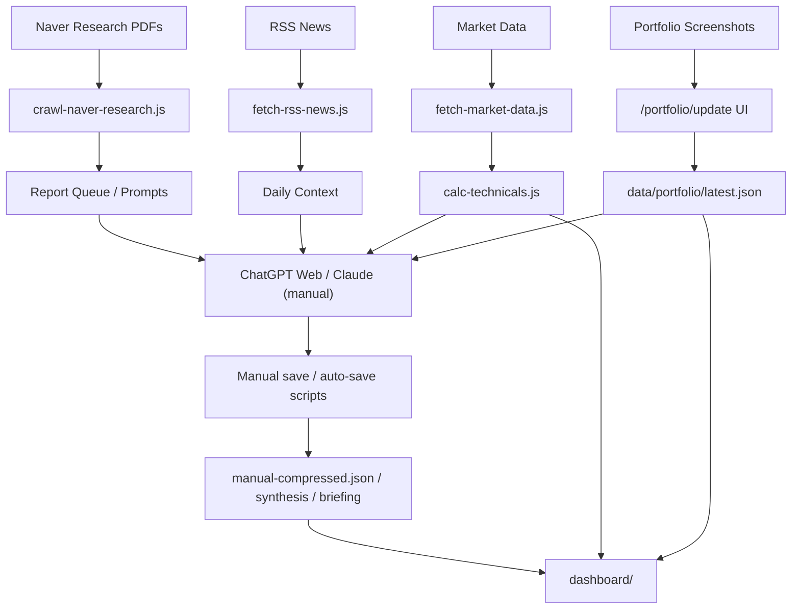

# EcoReport

Mac Mini에서 돌아가는 반자동 포트폴리오 인텔리전스 워크벤치입니다.  
핵심은 아래 3가지를 하나의 루프로 묶는 것입니다.

- 데이터 수집: 네이버 증권 리포트, RSS 뉴스, 시장 데이터, 계좌 스냅샷
- 해석: 기술 점수 + ChatGPT/Claude 웹 수동 LLM 해석
- 실행 가이드: 내 계좌 기준 점수, 보강/보류/분할매수 지침

현재 구조는 **API 자동 과금형**이 아니라 **수동 LLM 개입형**을 기본으로 합니다.  
즉, EcoReport가 재료를 준비하고, ChatGPT 웹 또는 Claude 앱/웹이 해석하고, 그 결과를 다시 EcoReport에 저장하는 방식입니다.

## 현재 목표

- 내 계좌 3개(ISA / 연금저축 / 토스증권)를 한 화면에서 본다
- 매일 수집되는 증권사 PDF/뉴스/시장 데이터가 내 계좌에 어떤 의미인지 연결한다
- 단순 요약이 아니라 "오늘 내 계좌를 어떻게 운용해야 하는지"를 제시한다
- LLM 비용은 최소화하고, 중요한 단계만 수동으로 개입한다

## 아키텍처



## 현재 운영 모드

### 1. 자동 수집 + 수동 LLM 해석

기본 모드입니다.

- 수집과 계산은 스크립트가 자동 수행
- LLM은 ChatGPT 웹으로 질문을 자동 전송
- 응답은 DOM에서 읽어 저장하거나, 수동 저장 UI에 붙여 넣음

### 2. 수집 스킵 스프린트

이미 오늘 데이터가 있으면 다시 크롤링하지 않고, 기존 데이터로만 GPT 스프린트를 돌립니다.

- `run-manual-gpt-sprint.sh`
- `run-chatgpt-full-sprint.sh`

## 디렉토리 구조

```text
stock-pilot/
├── config/                    # 전략, 관심종목, RSS 피드, 알림 규칙
├── dashboard/                 # Next.js 대시보드
├── data/
│   ├── market/                # 날짜별 시장 데이터
│   ├── news/                  # 날짜별 RSS 뉴스
│   ├── portfolio/             # 최신 계좌 스냅샷
│   ├── reports/               # 날짜별 PDF/텍스트/수동 요약
│   ├── technical/             # 날짜별 기술 점수
│   └── tweets/                # 날짜별 트윗 수집 결과
├── knowledge/
│   ├── daily/                 # triage/synthesis prompt, 응답, 큐 파일
│   ├── monthly/               # 월간 요약
│   └── weekly/                # 주간 요약
├── prompts/                   # API형 LLM 프롬프트 템플릿
├── reports/
│   └── daily/                 # advisory prompt, briefing
└── scripts/                   # 전체 파이프라인
```

## 핵심 데이터 스키마

### 1. 포트폴리오 스냅샷

파일:

- `data/portfolio/latest.json`

용도:

- 계좌별 평가금액, 예수금, 보유 종목, 종목별 손익/수익률 저장
- 대시보드와 포트폴리오 운용 가이드의 기준 데이터

예시 필드:

```json
{
  "date": "2026-04-03",
  "updatedAt": "2026-04-03T10:44:07.922Z",
  "source": {
    "method": "screenshot_review",
    "reviewer": "seo"
  },
  "accounts": [
    {
      "key": "ISA",
      "label": "ISA",
      "evaluationAmount": 8384240,
      "cashAvailable": 6277490,
      "principal": 6304001,
      "profitLoss": 2084749,
      "profitRate": 33.07,
      "incomplete": true,
      "holdings": [
        {
          "code": "458760",
          "name": "TIGER 미국배당+7%프리미엄다우존스",
          "quantity": 50,
          "marketValue": 510250,
          "purchaseValue": 510500,
          "profitLoss": -250,
          "profitRate": -0.05
        }
      ]
    }
  ]
}
```

### 2. 기술 점수

파일:

- `data/technical/YYYY-MM-DD.json`

용도:

- 종목/ETF별 기술적 상태를 점수화
- 포트폴리오 운용 점수의 기술 파트 입력값

현재 포함 지표:

- 이동평균선(5/20/60/120)
- RSI
- MACD
- 볼린저밴드
- 스토캐스틱
- ADX
- 거래량 비율

예시 필드:

```json
{
  "date": "2026-04-03",
  "market_context": {
    "signal": "NEUTRAL",
    "score": 43
  },
  "scores": {
    "360750": {
      "name": "TIGER 미국S&P500",
      "score": 70,
      "signal": "BUY",
      "signal_reason": "주가가 20일선 위에서 유지 중...",
      "rsi": 49.54,
      "macd": {
        "histogram": 4.5906
      },
      "alerts": [
        "MACD 시그널 상향 돌파"
      ]
    }
  }
}
```

### 3. 리포트 원본 인덱스

파일:

- `data/reports/YYYY-MM-DD/index.json`

용도:

- 네이버 증권 PDF 수집 결과 메타데이터
- 제목, 증권사, 카테고리, PDF 경로, 추출 텍스트 보관

### 4. 수동 PDF 요약 결과

파일:

- `data/reports/YYYY-MM-DD/manual-compressed.json`

용도:

- ChatGPT/Claude가 개별 PDF를 읽고 정리한 구조화 결과 저장
- 이후 synthesis/advisory에 우선 입력

현재 의도 스키마:

```json
[
  {
    "id": "report_001",
    "broker": "증권사명",
    "title": "리포트 제목",
    "tickers": ["005930"],
    "key_thesis": "핵심 주장",
    "new_info": "새로운 정보",
    "risks": ["리스크"],
    "themes": ["HBM4"],
    "impact": {
      "direction": "positive",
      "reason": "포트폴리오 관점 핵심 이유"
    }
  }
]
```

### 5. 일간 지식 파일

위치:

- `knowledge/daily/`

주요 파일:

- `*-report-summary-queue.md`: 오늘 읽을 PDF 우선순위
- `*-report-triage-prompt.md`: GPT에게 "무엇부터 읽을지" 묻는 프롬프트
- `*-report-triage-response.md`: GPT triage 응답 저장본
- `*-synthesis-prompt.md`: 오늘 시장/리포트 종합 프롬프트
- `*-synthesis.md`: 저장된 종합 응답

### 6. 브리핑 파일

위치:

- `reports/daily/`

주요 파일:

- `*-advisory-prompt.md`: 포트폴리오 운용 프롬프트
- `*-briefing.md`: 최종 운용 브리핑
- `*-portfolio-coach-prompt.md`: 계좌 운용 코치용 프롬프트

## 방법론

### A. 수집

1. 네이버 증권 리포트 PDF 수집
2. RSS 뉴스 수집
3. 시장 데이터 수집
4. 포트폴리오 스냅샷 반영

### B. 정리

1. 오늘 수집한 PDF를 우선순위 큐로 정렬
2. 중요한 PDF만 개별 요약
3. 요약된 PDF + 뉴스 + 시장 + 포트폴리오를 합쳐 시황 종합
4. 시황 종합 + 포트폴리오 + 기술점수로 최종 운용 가이드 생성

### C. 운용 점수

현재 계좌 운용 점수는 아래를 섞어 계산합니다.

- 배분 점수: 목표 배분 대비 현재 자산군 괴리
- 기술 점수: 계좌 내 보유 종목의 기술 점수 가중 평균

현재 구현은 이 두 축이 중심입니다.  
다음 단계로는 아래 항목을 추가해야 합니다.

- 리포트 영향 점수
- 계좌별 리포트 민감도
- 리포트/종목/계좌 간 양방향 연결

### D. 수동 LLM 원칙

API를 무조건 호출하지 않습니다.

- 데이터가 바뀐 경우에만 LLM 단계 재준비
- LLM은 ChatGPT 웹/Claude 웹 또는 앱에 수동 질문
- 답변은 DOM 읽기 또는 수동 저장

즉, 구조는:

- EcoReport = 데이터 엔진 + 저장소 + 대시보드
- GPT/Claude = 고급 해석기

## 실제 실행 명령

### 1. 오늘 데이터로 수집 포함 풀사이클 준비

```bash
cd /Users/seo/stock-pilot
bash scripts/run-cycle.sh --manual-llm
```

### 2. 이미 데이터가 있으면 수집 없이 스프린트

```bash
cd /Users/seo/stock-pilot
bash scripts/run-manual-gpt-sprint.sh --date 2026-04-03
```

### 3. ChatGPT 웹 전체 스프린트

```bash
cd /Users/seo/stock-pilot
bash scripts/run-chatgpt-full-sprint.sh --date 2026-04-03
```

### 4. 개별 모드별 ChatGPT 웹 전송

```bash
bash scripts/open-chatgpt-web-prompt.sh triage
bash scripts/open-chatgpt-web-prompt.sh queue
bash scripts/open-chatgpt-web-prompt.sh synthesis
bash scripts/open-chatgpt-web-prompt.sh coach
bash scripts/open-chatgpt-web-prompt.sh advisory
bash scripts/open-chatgpt-web-prompt.sh ask "오늘 내 계좌에서 가장 먼저 보강할 계좌는 어디고 왜 그래?"
bash scripts/open-chatgpt-web-prompt.sh file /Users/seo/stock-pilot/knowledge/daily/report-prompts/2026-04-03/report_001.md
```

## 현재 대시보드 기능

### 홈

- 최신 브리핑 표시
- 시장 카드
- 포트폴리오 총 평가/예수금/손익/수익률 요약
- 계좌별 운용 가이드 탭
- 계좌별 점수, 보유 종목 손익, 보유 수익률

### 포트폴리오

- 계좌별 보유 종목 한눈에 보기
- 종목별 손익/수익률
- 계좌별 보유 종목 합산 손익/수익률

### 포트폴리오 업데이트

- 계좌 스냅샷 수동 수정/저장
- 현재는 검수형 입력 중심
- 다음 단계는 OCR/비전 자동 채우기

### 수동 LLM 저장

- GPT/Claude 응답을 붙여 넣어 저장
- synthesis / advisory / report summary 저장 가능

## 현재 잘 되는 것

- Vercel 배포 및 외부 접속
- GitHub Actions 트리거
- ChatGPT 웹 자동 열기 및 프롬프트 주입
- ChatGPT 응답 DOM polling 및 일부 자동 저장
- 계좌 스냅샷 반영
- 기술 점수 계산
- 계좌별 운용 가이드 표시

## 아직 부족한 것

### 1. 리포트-계좌 양방향성

지금 가장 큰 약점입니다.

현재는:

- 리포트는 모음
- 요약은 가능
- 내 계좌 가이드도 나옴

하지만 아직 부족한 점:

- 어떤 리포트가 어떤 계좌 점수에 영향을 줬는지 구조화되어 있지 않음
- 특정 종목/계좌 관점에서 "오늘 중요한 리포트 3개"를 자동으로 뽑아주지 못함
- 리포트 변화가 계좌 점수에 직접 반영되지 않음

### 2. 리포트 영향 레이어 부재

다음 단계 핵심은 `impact-map.json` 같은 중간 계층입니다.

예상 스키마:

```json
{
  "date": "2026-04-03",
  "reports": [
    {
      "id": "report_001",
      "impacts": [
        {
          "targetType": "holding",
          "targetKey": "360750",
          "accountKey": "PENSION",
          "direction": "positive",
          "horizon": "3m",
          "strength": 0.72,
          "reason": "실적/목표가/신규 수급 논리"
        }
      ]
    }
  ]
}
```

이게 들어가야 진짜로:

- 리포트가 계좌 점수를 움직이고
- 계좌가 어떤 리포트를 더 읽어야 하는지 다시 정할 수 있습니다

### 3. Deep-research 기반 점수 고도화

현재 기술 점수는 전통 지표 기반입니다.

- RSI
- MACD
- 볼린저밴드
- 이평선
- 스토캐스틱
- ADX

다음 단계는 `deep-research-report.md` 기반으로:

- Direction
- Timing
- Regime
- ActionScore
- Conviction
- P(buy) / P(hold) / P(sell)

구조로 업그레이드하는 것입니다.

### 4. OCR 자동화

현재 포트폴리오 입력은 수동 검수형입니다.  
다음 단계는 계좌 캡처 이미지를 넣으면:

- 종목명
- 수량
- 평가금액
- 예수금

을 자동 추출해 입력칸을 채우는 기능입니다.

## 권장 운영 루프

### 가장 현실적인 일일 루프

1. 계좌 캡처 업로드 / 포트폴리오 최신화
2. `run-cycle.sh --manual-llm`
3. `triage`로 오늘 읽을 PDF 우선순위 확인
4. 상위 PDF만 개별 요약
5. `synthesis`로 오늘 시황 종합
6. `coach` / `advisory`로 실제 운용 가이드 생성
7. 필요한 결과를 대시보드에 저장

### 언제 API를 쓰나

지금은 기본적으로 쓰지 않습니다.  
향후 아래 경우에만 부분 도입을 고려합니다.

- PDF 개수가 급증해 수동 처리 한계가 올 때
- 특정 단계만 매일 자동으로 굴리고 싶을 때
- `synthesis` 또는 `advisory`만 자동화하고 싶을 때

## 운영 철학

EcoReport는 자동매매 시스템이 아닙니다.

- 데이터는 자동 수집
- 해석은 사람과 LLM이 함께
- 실행은 사람이 최종 결정

즉, 목표는 "AI가 대신 투자"가 아니라  
**"내 계좌와 시장 사이의 연결을 더 빠르고 깊게 읽어주는 리서치 코치"** 입니다.
