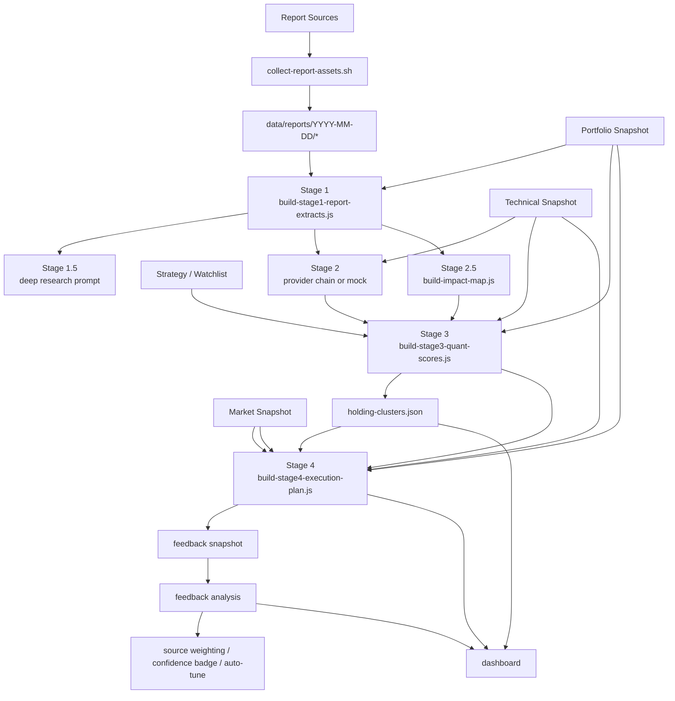

# EcoReport

EcoReport는 리포트 수집, 시장 데이터, 계좌 상태, 실행 계획을 하나의 로컬 워크벤치로 묶는 반자동 포트폴리오 인텔리전스 시스템입니다.

핵심 목표는 단순 요약이 아니라 아래 연결을 고정하는 것입니다.

- 리포트와 시장 데이터를 구조화한다.
- 계좌별 점수와 리스크를 재현 가능한 코드로 계산한다.
- 실제 실행 후보와 보류 사유까지 계좌 단위로 번역한다.
- 피드백 데이터를 다시 점수 체계와 대시보드에 반영한다.

## 현재 운영 모델

- 기본 운영: `Mac Mini + 로컬 실행 + private access`
- 기본 파이프라인: `run-daily-system.sh`
- 전략 파이프라인 핵심: `run-strategy-pipeline.sh`
- 대시보드 소스 오브 트루스: `dashboard/`
- 장기 기억 레이어: `knowledge/wiki/`

Stage 2는 LLM 연동이 포함되지만, Stage 1/2.5/3/4와 피드백 루프는 코드 기반 산출물을 남기도록 유지합니다.

## 빠른 시작

### 1. 일일 전체 러너

```bash
cd /Users/seo/stock-pilot
bash scripts/run-daily-system.sh --date YYYY-MM-DD
```

이 러너는 아래를 순서대로 실행합니다.

1. 포트폴리오 동기화 옵션 적용
2. 리포트 수집 + 전문 텍스트화
3. 시장 데이터 + 기술 지표 계산
4. RAG 코퍼스 갱신
5. Gemini 브리핑 옵션 실행
6. Stage 1~4 전략 파이프라인
7. Wiki 갱신
8. 시스템 검증
9. 선택적으로 GitHub/data 브랜치 동기화

### 2. 전략 파이프라인만 재실행

```bash
cd /Users/seo/stock-pilot
bash scripts/run-strategy-pipeline.sh --date YYYY-MM-DD
```

주요 옵션:

- `--gemini-stage2`: Gemini Stage 2 우선
- `--claude-stage2`: Claude Stage 2 우선
- `--mock-stage2`: 테스트용 mock 고정
- `--auto-tune-dry-run`: 피드백 기반 가중치 튜닝 시뮬레이션
- `--auto-tune`: `config/strategy.json` 실제 갱신

### 3. 대시보드

```bash
cd /Users/seo/stock-pilot/dashboard
npm run dev -- --hostname 0.0.0.0
```

기본 접속:

- 로컬: [http://localhost:3000](http://localhost:3000)
- 동일 네트워크: `http://<Mac-Mini-LAN-IP>:3000`

새 실험 UI는 상단 우측 `테스트 UI` 글로벌 토글로 전체 노출/미노출합니다.

## 현재 파이프라인 구조



요약:

- `Stage 1`: 리포트 구조화
- `Stage 2`: 전략 후보 생성
- `Stage 2.5`: 리포트 영향 확정
- `Stage 3`: 점수화, source weighting 반영
- `Stage 4`: 실행안, guardrail, cluster 경고 생성
- `Feedback`: 적중률/상관관계/소스 정확도 분석, 가중치 튜닝 입력

## 최신 대시보드 상태

현재 대시보드는 기본 운영 UI와 실험 UI를 함께 가집니다.

기본 UI:

- 시장 개요
- 계좌 현황과 실행 방향성
- 투자 방향성
- 모니터링 이벤트 레이어
- 추천 종목
- 리포트/브리핑

실험 UI 토글(`테스트 UI`)로 켜지는 항목:

- 배분 히트맵
- 실행계획 신뢰도 뱃지
- 피드백 대시보드
- 상관관계 클러스터

## 핵심 산출물

### 전략 산출물

- `data/analysis-state/YYYY-MM-DD/stage1-report-extracts-v2.json`
- `data/analysis-state/YYYY-MM-DD/stage2-strategy-options.json`
- `data/analysis-state/YYYY-MM-DD/stage2-strategy-options.mock.json`
- `data/analysis-state/YYYY-MM-DD/impact-map.json`
- `data/analysis-state/YYYY-MM-DD/stage3-quant-scores.json`
- `data/analysis-state/YYYY-MM-DD/stage4-execution-plan.json`
- `data/analysis-state/YYYY-MM-DD/holding-clusters.json`

### 피드백 산출물

- `data/feedback/snapshots/YYYY-MM-DD.json`
- `data/feedback/analysis/YYYY-MM-DD-feedback.json`
- `data/feedback/latest-feedback.json`
- `data/feedback/weight-history.jsonl`

### 운영/검증 산출물

- `data/analysis-state/YYYY-MM-DD/system-health.json`
- `data/analysis-state/YYYY-MM-DD/automation-cycle.json`
- `reports/daily/YYYY-MM-DD-briefing.md`
- `reports/daily/YYYY-MM-DD-stage4-execution-plan.md`

## 문서 진입 순서

처음 보면 이 순서가 가장 빠릅니다.

1. `README.md`
2. `docs/DOCS_MAP.md`
3. `docs/OPERATOR_RUNBOOK.md`
4. `docs/STAGE_1_4_ARCHITECTURE.md`
5. `docs/SCORE_SYSTEM_V2.md`

운영/실험/히스토리:

- 운영: [docs/OPERATOR_RUNBOOK.md](docs/OPERATOR_RUNBOOK.md)
- 실험/검증: [docs/EXPERIMENT_PLAYBOOK.md](docs/EXPERIMENT_PLAYBOOK.md)
- 변경 이력: [docs/UPDATE_LOG.md](docs/UPDATE_LOG.md)
- 대시보드 문서: [dashboard/README.md](dashboard/README.md)

## 운영 원칙

- 공개 배포보다 로컬 운영을 우선합니다.
- `main`에는 실제 운영 기준 문서와 스크립트를 유지합니다.
- 날짜 기준 산출물은 `data/analysis-state/YYYY-MM-DD`와 `data/feedback/*`에서 추적합니다.
- 구조가 바뀌면 코드와 함께 문서도 바로 갱신합니다.

## 지금 기준의 관리 포인트

- 문서는 `README`와 `DOCS_MAP`을 진입점으로 삼습니다.
- 운영 절차는 `OPERATOR_RUNBOOK`을 기준으로 맞춥니다.
- 점수/실행/피드백 구조는 `STAGE_1_4_ARCHITECTURE`와 `SCORE_SYSTEM_V2`를 기준으로 봅니다.
- 기본이 아닌 실험/역사성 문서는 2차 참고 자료로 취급합니다.
