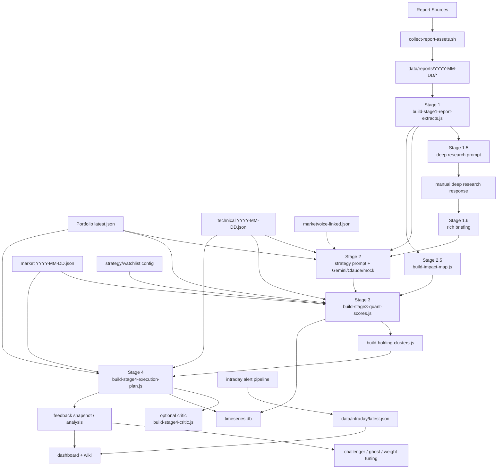

# EcoReport

EcoReport는 증권사 리포트, 시장 데이터, 계좌 상태, 실행 계획, 피드백 루프를 하나의 로컬 워크벤치로 묶는 포트폴리오 인텔리전스 시스템입니다.

핵심 목표는 “요약”이 아니라 아래 연결을 재현 가능하게 유지하는 것입니다.

- 리포트를 구조화된 fact anchor로 바꾼다.
- LLM 전략 탐색 결과를 계좌별 실행안으로 번역한다.
- Stage 3 점수와 Stage 4 실행안을 코드로 다시 계산한다.
- 피드백, 챌린저, 고스트 포트폴리오를 통해 후행 검증을 남긴다.
- 대시보드와 위키가 같은 산출물을 읽도록 유지한다.

## 공용 진입 문서

Claude Code와 Codex가 같이 작업할 때는 아래 순서로 보는 것을 기본으로 합니다.

1. `README.md`
2. `docs/EXECUTION_GUIDE.md`
3. `docs/MULTI_TOOL_HANDOFF.md`

`docs/EXECUTION_GUIDE.md`는 역할 설명보다 "딥리서치 하려면 무엇을 실행하는가", "수동 LLM 스프린트를 이어서 하려면 어느 파일을 여는가" 중심으로 정리한 공용 실행 가이드입니다.

## 작업별 바로 가기

### 일일 전체 파이프라인

```bash
cd /Users/seo/stock-pilot
bash scripts/run-daily-system.sh --date YYYY-MM-DD
node scripts/verify-daily-system.js --date YYYY-MM-DD
```

### 수동 LLM용 재료만 준비

```bash
cd /Users/seo/stock-pilot
bash scripts/run-cycle.sh --date YYYY-MM-DD --manual-llm
```

이미 수집된 데이터로 프롬프트만 다시 만들려면:

```bash
cd /Users/seo/stock-pilot
bash scripts/run-cycle.sh --date YYYY-MM-DD --manual-llm --skip-collect
```

### 딥리서치 / manual-kit

```bash
cd /Users/seo/stock-pilot
node scripts/build-stage1-5-gemini-deep-research-prompt.js --date YYYY-MM-DD
node scripts/run-gemini-deep-research-web.js --date YYYY-MM-DD
node scripts/build-stage1-6-rich-briefing.js --date YYYY-MM-DD
```

### Stage 1~4 전략 파이프라인만 재실행

```bash
cd /Users/seo/stock-pilot
bash scripts/run-strategy-pipeline.sh --date YYYY-MM-DD
bash scripts/run-strategy-pipeline.sh --date YYYY-MM-DD --claude-stage2
```

### ChatGPT 수동 스프린트 이어서 열기

```bash
cd /Users/seo/stock-pilot
bash scripts/open-chatgpt-web-prompt.sh triage
bash scripts/open-chatgpt-web-prompt.sh synthesis
bash scripts/open-chatgpt-web-prompt.sh coach
bash scripts/open-chatgpt-web-prompt.sh advisory
```

## 현재 운영 모델

- 실행 환경: `Mac Mini + 로컬 실행 + private access`
- 루트 워크스페이스: `/Users/seo/stock-pilot`
- 프론트엔드 워크스페이스: `dashboard/` (`package.json` workspaces 사용)
- 일일 마스터 러너: `scripts/run-daily-system.sh`
- 전략 파이프라인: `scripts/run-strategy-pipeline.sh`
- DAG 러너: `scripts/run-pipeline-dag.js`
- 장중 경보 파이프라인: `scripts/run-intraday-alert-pipeline.js`
- 대시보드 소스 오브 트루스: `dashboard/`
- 장기 기억 레이어: `knowledge/wiki/`

## 빠른 시작

### 1. 일일 전체 러너

```bash
cd /Users/seo/stock-pilot
bash scripts/run-daily-system.sh --date YYYY-MM-DD
```

주요 옵션:

- `--use-dag`: `config/pipeline-manifest.yaml` 기반 DAG 실행
- `--gemini-stage2`: Stage 2를 Gemini 우선으로 실행
- `--claude-stage2`: Stage 2를 Claude 우선으로 실행
- `--mock-stage2`: Stage 2를 mock으로 고정
- `--skip-collect`, `--skip-rag`, `--skip-strategy`, `--skip-wiki`, `--skip-verify`
- `--no-gemini-briefing`, `--gemini-briefing`

### 2. 전략 파이프라인만 재실행

```bash
cd /Users/seo/stock-pilot
bash scripts/run-strategy-pipeline.sh --date YYYY-MM-DD
```

이 러너는 Stage 1 -> 1.5 -> 1.6 -> 2 -> 2.5 -> 3 -> holding-clusters -> 4 -> feedback snapshot까지 집중 실행합니다.

### 3. 장중 경보/부분 재점수

```bash
cd /Users/seo/stock-pilot
node scripts/run-intraday-alert-pipeline.js --date YYYY-MM-DD --dry-run
```

현재 장중 파이프라인은 아래를 수행합니다.

- `fetch-market-data-lite.js`로 경량 시세 스냅샷 수집
- `evaluate-alert-triggers.js`로 VIX/환율/보유종목 급변 경보 평가
- 트리거 발생 시 `recompute-stage3-intraday.js`로 intraday overlay 생성
- `data/intraday/latest.json` 갱신
- Telegram 긴급 알림 전송

### 4. 대시보드

```bash
cd /Users/seo/stock-pilot/dashboard
npm install
npm run dev -- --hostname 0.0.0.0
```

검증:

```bash
cd /Users/seo/stock-pilot/dashboard
npm run build
```

### 5. 리포트 요약 충실도 검증

```bash
cd /Users/seo/stock-pilot
node scripts/validate-briefing-fidelity.js --date YYYY-MM-DD
```

이 검증은 `rich briefing`과 `Stage 2 prompt`가 중요한 extract의 제목, 숫자 anchor, 조건/반론 anchor를 얼마나 보존했는지 확인합니다.

## 현재 파이프라인 구조



요약:

- `Stage 1`: 리포트 구조화 + 포트폴리오 연결
- `Stage 1.5 / 1.6`: Deep Research와 rich briefing 보강
- `Stage 2`: 전략 옵션 탐색
- `Stage 2.5`: 리포트 영향 확정 레이어
- `Stage 3`: 점수화, 분해 점수, SQLite 적재
- `Stage 4`: 실행안, critic 병합, Telegram 요약 입력
- `Feedback / Challenger / Ghost`: 사후 검증과 가중치 실험
- `Intraday`: 경량 경보와 intraday score overlay

## 저장소 구조

상세 구조는 [docs/REPO_STRUCTURE.md](docs/REPO_STRUCTURE.md)에 정리되어 있습니다.

핵심 디렉터리만 먼저 보면:

- `scripts/`: 운영 파이프라인과 데이터 산출 로직
- `scripts/lib/`: 공용 유틸, 분석 컨텍스트, SQLite 래퍼
- `config/`: 전략, 계약, DAG, Telegram, alerts 설정
- `data/analysis-state/YYYY-MM-DD/`: 일자별 Stage 산출물
- `data/feedback/`: 스냅샷, 분석, challenger, ghost 추적
- `data/intraday/`: 장중 스냅샷과 경보 상태
- `data/timeseries.db`: Stage 3/4 이중화 저장소
- `dashboard/app/`: Next.js 16 app router 엔트리와 실험 페이지
- `dashboard/components/`: 범용 시각화/탭/패널 컴포넌트
- `knowledge/daily/`: 브리핑, prompt, 검증 메모
- `knowledge/wiki/`: 누적 기억, 운영 규칙, 증권별 메모

## 대시보드 현재 구조

메인 엔트리:

- `dashboard/app/page.tsx`: 메인 대시보드 조립
- `dashboard/app/lib/data-loader.ts`: intraday / ghost / backtest 보조 로더
- `dashboard/app/api/intraday/route.ts`: 장중 polling endpoint
- `dashboard/app/simulator/page.tsx`: What-if simulator

최근 추가된 app 전용 컴포넌트:

- `dashboard/app/components/IntradayAutoRefresh.tsx`
- `dashboard/app/components/IntradayAlertBanner.tsx`
- `dashboard/app/components/EvidenceChain.tsx`
- `dashboard/app/components/ScoreBreakdownPanel.tsx`
- `dashboard/app/components/GhostPortfolio.tsx`
- `dashboard/app/components/BacktestSummary.tsx`

기존 공용 대시보드 컴포넌트:

- `dashboard/components/MainNav.tsx`
- `dashboard/components/FeedbackPanel.tsx`
- `dashboard/components/AllocationHeatmap.tsx`
- `dashboard/components/ClusterMap.tsx`
- `dashboard/components/AccountTabs.tsx`
- `dashboard/components/HoldingTabs.tsx`
- `dashboard/components/RecommendationTabs.tsx`

## 핵심 산출물

### 전략 / 운영 산출물

- `data/analysis-state/YYYY-MM-DD/stage1-report-extracts-v2.json`
- `data/analysis-state/YYYY-MM-DD/impact-map.json`
- `data/analysis-state/YYYY-MM-DD/stage2-strategy-options.json`
- `data/analysis-state/YYYY-MM-DD/stage3-quant-scores.json`
- `data/analysis-state/YYYY-MM-DD/holding-clusters.json`
- `data/analysis-state/YYYY-MM-DD/stage4-execution-plan.json`
- `data/analysis-state/YYYY-MM-DD/rebalancing-schedule.json`
- `data/analysis-state/YYYY-MM-DD/pipeline-run.json`
- `data/analysis-state/YYYY-MM-DD/stage-contract-validation.json`
- `data/analysis-state/YYYY-MM-DD/briefing-fidelity-validation.json`

### 장중 / 운영 알림

- `data/intraday/latest.json`
- `data/intraday/YYYY-MM-DD/market-lite.json`
- `data/intraday/YYYY-MM-DD/emergency-alerts.json`
- `data/analysis-state/YYYY-MM-DD/stage3-intraday-updates.json`

### 피드백 / 검증 / 백테스트

- `data/feedback/snapshots/YYYY-MM-DD.json`
- `data/feedback/analysis/YYYY-MM-DD-feedback.json`
- `data/feedback/challenger-weights.json`
- `data/feedback/challenger-backtest.json`
- `data/feedback/ghost-portfolio.jsonl`
- `data/backtest/engine-latest.json`
- `data/timeseries.db`

## 문서 진입 순서

1. `README.md`
2. `docs/EXECUTION_GUIDE.md`
3. `docs/REPO_STRUCTURE.md`
4. `docs/OPERATOR_RUNBOOK.md`
5. `docs/STAGE_1_4_ARCHITECTURE.md`
6. `docs/SCORE_SYSTEM_V2.md`
7. `dashboard/README.md`

## 운영 원칙

- 공개 배포보다 로컬 운영을 우선합니다.
- 날짜 기준 산출물은 `data/analysis-state/YYYY-MM-DD`, `data/intraday`, `data/feedback`에서 추적합니다.
- 대시보드와 위키는 가능한 한 동일 파일 산출물을 읽습니다.
- 구조나 실행 흐름이 바뀌면 코드와 함께 `README.md`, `docs/EXECUTION_GUIDE.md`, 관련 runbook를 같이 갱신합니다.
