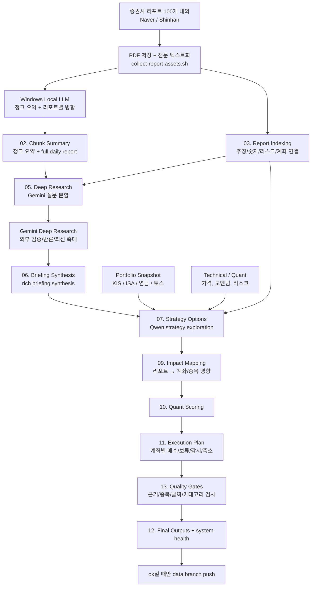
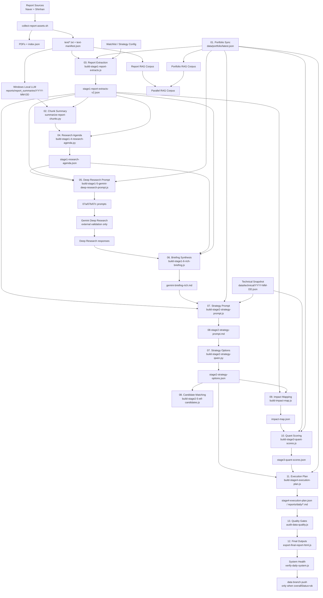

# EcoReport

> **실행하려면 → [`docs/EXECUTION_GUIDE.md`](docs/EXECUTION_GUIDE.md) 먼저 보세요.**

EcoReport는 Mac Mini에서 돌아가는 반자동 포트폴리오 인텔리전스 워크벤치입니다.

> 현재 기준 워크스페이스는 `/Users/seo/Documents/Playground/economy-report` 입니다.  
> `open-trading-api/`는 이제 이 루트 안에 같이 두고, 이전 체크아웃은 `/Users/seo/Documents/Playground/stock-pilot-archive`에 보관합니다.

핵심 목표는 하나입니다.

- 리포트를 많이 모으는 것이 아니라
- 리포트, 기술지표, 내 계좌 상태를 같은 구조 안에 넣고
- 실제 계좌 운용 지침까지 연결하는 것

현재 기본 모드는 **리포트 원문 기반의 반자동 투자 리서치 파이프라인**입니다.
EcoReport가 수집, 텍스트화, 계좌/퀀트 결합, 검증, 기록을 맡고, LLM은 단계별로 제한된 역할만 맡습니다.

## 현재 목표

- ISA / 연금저축 / 토스증권 계좌를 하나의 모델로 다루기
- 증권사 PDF를 단순 요약이 아니라 연구 노트 형태로 축적하기
- 기술지표와 리포트 영향을 같이 반영한 계좌 점수 만들기
- 최종적으로 "오늘 뭘 보강/보류/관망할지"를 계좌 단위로 제시하기
- 100개 리포트에서 매일 달라진 비평균 신호, 신규 후보, 반대 근거를 보존하기

## 핵심 원칙

- `igzun-daily-report`는 참고 레퍼런스일 뿐, EcoReport 런타임 의존성이 아닙니다.
- 수집 후에는 반드시 `PDF 전문 텍스트화`를 거칩니다.
- 리포트 요약을 여러 번 평균내지 않고, 주장/숫자/촉매/리스크/신규 후보를 구조화해 보존합니다.
- Stage 7 전략 탐색은 Qwen 실제 LLM 결과가 필요하며, mock fallback은 운영 경로에서 금지합니다.
- Gemini Deep Research는 최종 요약자가 아니라 외부 검색, 반증, 최신 촉매 확인용 보조 레이어입니다.
- 전략 비중은 `안전자산 20% / 코어 30% / 위성 섹터 50%`를 기본 축으로 보고, 위성 섹터는 카테고리/클러스터 한도로 쏠림을 제어합니다.
- `system-health`가 `ok`인 완성 데이터만 `data` 브랜치에 push합니다.
- Vercel 배포는 완성 데이터가 안정될 때까지 중단합니다.

## 현재 기준 디렉토리

- 실행 루트: `/Users/seo/Documents/Playground/economy-report`
- KIS helper: `/Users/seo/Documents/Playground/economy-report/open-trading-api`
- 보조 worktree: `/Users/seo/Documents/Playground/economy-report-main-merge`, `/Users/seo/Documents/Playground/economy-report-main-publish`
- 레거시 아카이브: `/Users/seo/Documents/Playground/stock-pilot-archive`
- GitHub 원격: `sgdrudejr/EcoReport` 유지

## 현재 운영 방향 (2026-04)

최근 운영상 가장 큰 문제는 최종 산출물이 너무 평균화되어 1주일 내내 비슷한 말을 반복한다는 점입니다.
따라서 EcoReport의 방향은 "더 긴 요약"이 아니라 **오늘 달라진 투자 신호를 잃지 않는 구조화**로 바뀝니다.

핵심 질문은 아래입니다.

- 오늘 새로 등장한 주장과 종목은 무엇인가?
- 기존 보유 종목의 thesis를 약화시키는 근거는 무엇인가?
- 컨센서스와 반대로 말하는 리포트는 무엇인가?
- 신규 후보가 기존 보유 종목을 대체하거나 보강할 만큼 강한가?
- 실제 계좌에서 오늘 할 일은 매수, 보류, 감시, 축소 중 무엇인가?

Gemini Deep Research는 계속 사용할 수 있지만, 역할은 축소합니다.

- `해야 할 일`: 외부 웹 검색, 최신 데이터 확인, 반론 찾기, 정책/산업 촉매 검증
- `하지 말아야 할 일`: 100개 리포트 전체를 다시 평균 요약해 최종 결론을 만드는 일

## 현재 플로우

100개 안팎의 증권사 리포트를 수집한 뒤, 로컬/외부 LLM과 코드 단계를 아래처럼 나누어 씁니다.



### 역할 분담

| 담당 | 역할 | 하지 않는 일 |
|------|------|-------------|
| Mac Mini 코드 | 수집, 텍스트화, 계좌/퀀트 결합, 검증, 기록 | 투자 판단을 임의 생성하지 않음 |
| Windows Local LLM | 긴 PDF/청크를 싸게 많이 읽고 리포트별 요약 생성 | 최종 매매 판단을 내리지 않음 |
| Qwen API | Research agenda, 전략 JSON, 계좌별 액션 후보 생성 | 원문 100개를 통째로 다시 평균 요약하지 않음 |
| Gemini Deep Research | 외부 검색, 최신 이슈, 반론, 촉매 검증 | 내부 리포트의 최종 결론을 덮어쓰지 않음 |
| Quant/Technical | 매수 가능 타이밍과 리스크 필터 | 리포트 thesis를 대체하지 않음 |

### 왜 이렇게 나누는가

리포트 100개에서 중요한 것은 평균 의견이 아니라 희소한 변화입니다.
그래서 EcoReport는 앞으로 아래 산출물을 더 중요하게 봅니다.

- `오늘 새로 등장한 주장`
- `기존 보유 종목에 불리한 근거`
- `반대 의견 또는 thesis 파괴 조건`
- `신규 후보와 기존 보유의 대체/보강 관계`
- `계좌별 실행 가능성`
- `어제와 달라진 액션`

좋은 산출물은 "AI 전력/방산/금리 주시"처럼 넓은 문장이 아니라,
"어떤 리포트의 어떤 숫자 때문에 어느 계좌의 어떤 종목 액션이 바뀌었는지"를 설명해야 합니다.

---

## 아키텍처 (전체)



별도 아키텍처 문서:

- 단계 이름 기준: [docs/STAGE_NAMES.md](docs/STAGE_NAMES.md)

- [PIPELINE_MAP.md](docs/PIPELINE_MAP.md)
- [DOCS_MAP.md](docs/DOCS_MAP.md)
- [StockPilot Docs](docs/stockpilot/README.md)
- [MULTI_TOOL_HANDOFF.md](docs/MULTI_TOOL_HANDOFF.md)
- [EXPERIMENT_PLAYBOOK.md](docs/EXPERIMENT_PLAYBOOK.md)
- [STAGE_1_4_ARCHITECTURE.md](docs/STAGE_1_4_ARCHITECTURE.md)
- [OPERATOR_RUNBOOK.md](docs/OPERATOR_RUNBOOK.md)
- [ECOREPORT_DAILY_AUTOMATION.md](docs/ECOREPORT_DAILY_AUTOMATION.md)
- [SCORE_SYSTEM_V2.md](docs/SCORE_SYSTEM_V2.md)
- [PRIVATE_ACCESS_RUNBOOK.md](docs/PRIVATE_ACCESS_RUNBOOK.md)
- [FAILURES_AND_FALLBACKS.md](FAILURES_AND_FALLBACKS.md)
- [UPDATE_LOG.md](docs/UPDATE_LOG.md)

## 문서 읽는 순서

여러 코딩 프로그램이나 다른 담당자가 이어받을 수 있게 문서를 역할별로 나눴습니다.

- 처음 들어오면: `README.md`
- 전체 파이프라인을 한눈에 보면: `docs/PIPELINE_MAP.md`
- 어떤 문서를 읽어야 할지 모르겠으면: `docs/DOCS_MAP.md`
- StockPilot 수식/데이터/로드맵 작업이면: `docs/stockpilot/README.md`
- 여러 툴이 번갈아 작업하면: `docs/MULTI_TOOL_HANDOFF.md`
- 실제 실행/운영은: `docs/OPERATOR_RUNBOOK.md`
- 매일 자동화와 최종 출력물 재생성은: `docs/ECOREPORT_DAILY_AUTOMATION.md`
- 실험/검증/회귀 테스트는: `docs/EXPERIMENT_PLAYBOOK.md`
- 실패 원인과 폴백은: `FAILURES_AND_FALLBACKS.md`
- 최근 변경 이력은: `docs/UPDATE_LOG.md`

### 다음 Codex에게 전달할 고정 시작 순서 (핸드오프)

다음 세션을 시작할 때는 아래 순서로 읽고 작업을 시작합니다.

1. `docs/PROJECT_MEMORY.md`
2. `docs/SESSION_HANDOFF.md`
3. `docs/MULTI_TOOL_HANDOFF.md`
4. `README.md`
5. `docs/EXECUTION_GUIDE.md`

참고:

- 현재 기준 워크스페이스는 `/Users/seo/Documents/Playground/economy-report` 입니다.
- `/Users/seo/Documents/Playground/stock-pilot-archive`는 보관용 아카이브입니다.

## 매일 운영 명령

가장 권장하는 일일 실행 방법은 아래 한 줄입니다. (`daily`는 `automation:daily`와 동일)

```bash
cd /Users/seo/Documents/Playground/economy-report
npm run daily -- --date YYYY-MM-DD
```

### 자동화 체크포인트 / 재개 규약

- `scripts/run-daily-automation-cycle.js`는 각 스텝 완료 시 `data/analysis-state/YYYY-MM-DD/checkpoints/<stepId>-complete.json`을 남깁니다.
- 체크포인트에는 `completedAt`, `status`, `failurePolicy`, `failureCategory`, `artifacts`, `rowCount`, `runId`가 기록됩니다.
- 다음 실행에서 같은 날짜의 체크포인트가 있으면 이미 처리된 스텝은 재사용하고, 남은 스텝부터 이어서 진행합니다.
- `npm run daily -- --date YYYY-MM-DD --fresh-start`를 주면 체크포인트를 지우고 처음부터 다시 돕니다.

### 실패 정책

- `block`: 앞 단계가 실패하면 해당 지점에서 중단하고 알림/로그를 남깁니다. 예: `baseline_daily_system`, `stage1_extracts`
- `degrade`: 실패해도 경고 상태로 체크포인트를 남기고 다음 단계로 진행합니다. 예: `windows_local_summary`, `Qwen API agenda`, `Gemini web`, `rich briefing`

이 구분 덕분에 Windows LLM 타임아웃, Gemini 세션 실패, Qwen rate limit이 나와도 매일 파이프라인 전체가 무조건 처음부터 다시 깨지지 않고, 가능한 범위에서 재개됩니다.

### Telegram 알림

일일 자동화 러너(`scripts/run-daily-automation-cycle.js`)는 단계 진행/결과를 요약해 텔레그램 알림 스크립트와 함께 운영할 수 있습니다.

사전 설정:

```bash
export TELEGRAM_BOT_TOKEN="your-bot-token"
export TELEGRAM_CHAT_ID="your-chat-id"
```

임의 명령(예: 테스트, 배포, 백필) 완료/실패를 텔레그램으로 받고 싶으면 아래 래퍼를 사용합니다.

```bash
cd /Users/seo/Documents/Playground/economy-report
cp config/telegram_notify.env.example config/telegram_notify.env
# config/telegram_notify.env에 BOT_TOKEN / CHAT_ID 입력
bash scripts/run-with-telegram-notify.sh <command> [args...]
```

예시:

```bash
bash scripts/run-with-telegram-notify.sh npm run automation:daily -- --date YYYY-MM-DD
```

주의:

- 토큰/채팅 ID가 들어간 `config/telegram_notify.env`는 `.gitignore`에 포함되어 Git에 올라가지 않습니다.

동일 명령(완결형 자동 실행)은 아래와 같습니다.

```bash
cd /Users/seo/Documents/Playground/economy-report
npm run automation:daily -- --date YYYY-MM-DD
```

이 러너는 다음을 한 번에 묶습니다.

1. 리포트 수집 + 전문 텍스트화
2. Windows Local LLM 리포트별 요약
3. 시장 데이터 수집 + 기술 점수 계산
4. 리포트/포트폴리오/병렬 RAG 재생성
5. Research agenda + Gemini 외부 검증 프롬프트 생성
6. Qwen 실제 LLM 기반 Stage 7 전략 탐색
7. Impact map, Quant scoring, Execution plan 생성
8. `knowledge/wiki/` 지속형 투자 위키 갱신
9. 일일 시스템 검증 리포트 생성
10. `system-health=ok`일 때만 `data` 브랜치 동기화

검증 결과는 아래에 저장됩니다.

- `data/analysis-state/YYYY-MM-DD/system-health.json`
- `knowledge/daily/YYYY-MM-DD-system-health.md`
- `data/analysis-state/YYYY-MM-DD/automation-cycle.json`
- `knowledge/daily/YYYY-MM-DD-automation-cycle.md`

## StockEasy 역추정 재현 (매크로 백필 포함)

StockEasy 전략(모멘텀/피크/밸류) 매수·매도 스타일을 다시 추정할 때는 아래 순서로 실행합니다.

```bash
cd /Users/seo/Documents/Playground/economy-report

# 1) FRED 코어 매크로 백필 (옵션 1)
python3 scripts/backfill-fred-core-macro.py --start 2025-12-01 --end 2026-04-17

# 2) 전략별 거래 이력 캡처 (필요 시)
node scripts/capture-stockeasy-strategy-history.js --date 2026-04-18 --strategy momentum
node scripts/capture-stockeasy-strategy-history.js --date 2026-04-18 --strategy peak
node scripts/capture-stockeasy-strategy-history.js --date 2026-04-18 --strategy value

# 3) 전략별 역추정
node scripts/analyze-stockeasy-reverse-engineering.js --date 2026-04-18 --strategy momentum --min-date 2025-12-01
node scripts/analyze-stockeasy-reverse-engineering.js --date 2026-04-18 --strategy peak --min-date 2025-12-01
node scripts/analyze-stockeasy-reverse-engineering.js --date 2026-04-18 --strategy value --min-date 2025-12-01
```

생성 경로:

- JSON: `data/analysis-state/YYYY-MM-DD/stockeasy-*-reverse-engineering.json`
- 요약: `knowledge/daily/YYYY-MM-DD-stockeasy-*-reverse-engineering.md`
- 통합 비교: `knowledge/daily/YYYY-MM-DD-stockeasy-style-comparison.md`

포트폴리오가 한국투자증권 Open API와 연결되어 있다면, 일일 러너는 시작 전에
`data/portfolio/latest.json`에 KIS 계좌 스냅샷을 먼저 반영합니다.

수동으로만 먼저 갱신하고 싶을 때는 아래 명령을 사용합니다.

```bash
cd /Users/seo/Documents/Playground/economy-report
npm run portfolio:sync:kis -- --date YYYY-MM-DD
```

Shadow 파이프라인만 따로 확인하고 싶을 때는 아래 명령을 사용합니다.

```bash
cd /Users/seo/Documents/Playground/economy-report
npm run shadow:pipeline -- --date YYYY-MM-DD
```

이 러너는 아래 4단계를 묶습니다.

1. `build-report-chunk-index.js`
2. `build-stage1-shadow-extracts.js`
3. `build-stage2-shadow-topic-buckets.js`
4. `build-stage3-shadow-final-insights.js`

출력은 기존 legacy 경로와 canonical mirror 경로에 같이 남습니다.

- legacy 예시:
  - `data/analysis-state/YYYY-MM-DD/chunk-index/*`
  - `data/analysis-state/YYYY-MM-DD/stage1-shadow/*`
  - `data/analysis-state/YYYY-MM-DD/stage2-shadow-topic-buckets.json`
  - `data/analysis-state/YYYY-MM-DD/stage3-shadow-final-insights.json`
- canonical mirror 예시:
  - `data/analysis-state/YYYY-MM-DD/shadow/stage0/*`
  - `data/analysis-state/YYYY-MM-DD/shadow/stage1/*`
  - `data/analysis-state/YYYY-MM-DD/shadow/stage2/*`
  - `data/analysis-state/YYYY-MM-DD/shadow/stage3/*`

계좌 매핑은 `config/portfolio-sync.json`에서 관리합니다.

자동 실행 전제:

- Mac이 잠겨 있지 않아야 합니다.
- Safari가 Gemini에 로그인된 상태여야 합니다.
- Deep Research 단계가 실패해도 baseline 리포트와 실패 요약은 남도록 설계합니다.

## LLM Wiki Layer

EcoReport는 이제 일일 산출물을 `persistent wiki`로 다시 컴파일합니다.

- 입력: `data/`, `knowledge/daily/`, `reports/daily/`
- 지속형 메모리: `knowledge/wiki/`
- 목적: 같은 리포트를 반복해서 다시 읽지 않고, 계좌/종목 thesis를 누적하는 것

핵심 명령:

```bash
cd /Users/seo/Documents/Playground/economy-report
node scripts/build-llm-wiki.js --date YYYY-MM-DD
node scripts/publish-llm-wiki-to-vault.js
```

생성물:

- `knowledge/wiki/index.md`
- `knowledge/wiki/log.md`
- `knowledge/wiki/overview.md`
- `knowledge/wiki/daily/YYYY-MM-DD.md`
- `knowledge/wiki/accounts/*.md`
- `knowledge/wiki/securities/*.md`

Obsidian에서 바로 보려면 publish 결과도 같이 봅니다.

- vault 기본 위치: `/Users/seo/my-wiki`
- publish 위치: `/Users/seo/my-wiki/wiki/ecoreport`
- raw context 위치: `/Users/seo/my-wiki/raw/ecoreport`

이 레이어는 단순 기록용이 아니라, 실제 자본 배치에 도움이 되는 질문에 빠르게 답하기 위해 존재합니다.

- 오늘 새 돈을 어디에 넣어야 하는가
- 어떤 보유 자산의 thesis가 약해졌는가
- 며칠째 반복해서 살아남는 후보는 무엇인가

자세한 운영 개념은 [LLM_WIKI_SYSTEM.md](docs/LLM_WIKI_SYSTEM.md)를 참고합니다.

## 접속 방식

기본 운영은 이제 **공개 배포보다 로컬 우선**입니다.

- 기본: Mac Mini 로컬 실행 + private access
- 선택: 검증 통과 후 `data` 브랜치 보조 대시보드

Vercel 배포는 완성 데이터가 안정될 때까지 중단합니다.
공개 배포가 불안정할 때는 Tailscale 같은 tailnet 기반 접속을 권장합니다.

### 현재 권장 접속 경로

개발/검증 중에는 아래를 기준으로 봅니다.

```bash
cd /Users/seo/Documents/Playground/economy-report/dashboard
npm run dev -- --hostname 0.0.0.0
```

그다음 같은 Mac Mini에서는:

- [http://localhost:3000](http://localhost:3000)

같은 와이파이 기기에서는:

- `http://<Mac-Mini-LAN-IP>:3000`

로 접속합니다.

즉, **지금 기준의 진짜 소스 오브 트루스는 `localhost:3000`** 입니다.

운영 가이드는 아래 문서를 따릅니다.

- [PRIVATE_ACCESS_RUNBOOK.md](docs/PRIVATE_ACCESS_RUNBOOK.md)
- [VERCEL_DEPLOY_RUNBOOK.md](docs/VERCEL_DEPLOY_RUNBOOK.md)
- [UPDATE_LOG.md](docs/UPDATE_LOG.md)
- [FAILURES_AND_FALLBACKS.md](FAILURES_AND_FALLBACKS.md)

### 대시보드 로컬 키 설정

로컬 대시보드에서 OCR과 GitHub 동기화를 자동으로 쓰려면 아래 파일을 채웁니다.

```bash
cd /Users/seo/Documents/Playground/economy-report/dashboard
cp .env.local.example .env.local
```

그다음 `dashboard/.env.local`에 값을 넣습니다.

```bash
GEMINI_API_KEY=...
GEMINI_PORTFOLIO_MODEL=gemini-2.5-flash
GITHUB_TOKEN=...
```

동작 방식:

- `GEMINI_API_KEY`: `/portfolio/update`의 이미지 OCR, 일괄 분류, 숫자 추출
- `GITHUB_TOKEN`: 포트폴리오 저장 시 `main` 자동 동기화, 수동 LLM 저장 동기화, 대시보드의 분석 실행 버튼에서 GitHub `repository_dispatch` 호출

즉 `GITHUB_TOKEN`이 들어가 있으면 `/portfolio/update`에서 저장할 때 로컬 파일 저장 후 GitHub `main`에도 자동 반영됩니다.

권한 메모:

- 고전형 PAT를 쓴다면 보통 `repo` 권한이면 충분합니다.
- fine-grained PAT를 쓴다면 이 저장소 기준 `Contents: write`가 필요합니다.

## Canonical Stage Map

이제부터 사람이 읽는 공식 단계 이름은 `NN. English Step Name`을 기준으로 맞춥니다.
기존 파일명과 legacy npm alias는 하위 호환 때문에 유지될 수 있지만, 운영/자동화/문서는 아래 번호를 기준으로 사용합니다.

1. `01. Report Collection`
2. `02. Chunk Summary`
3. `03. Report Indexing`
4. `04. Research Agenda`
5. `05. Deep Research`
6. `06. Briefing Synthesis`
7. `07. Strategy Options`
8. `08. Candidate Matching`
9. `09. Impact Mapping`
10. `10. Quant Scoring`
11. `11. Execution Plan`
12. `12. Final Outputs`
13. `13. Quality Gates`

자세한 기준은 [docs/STAGE_NAMES.md](docs/STAGE_NAMES.md)와 `config/stage-names.json`에 고정합니다.

### Execution Roles

1. `Mac`
- 수집, 텍스트화, 포트폴리오 스냅샷, 구조화 추출, 프롬프트 생성, 정량 점수, 실행계획, 자동화/검증/텔레그램을 담당합니다.

2. `Windows Local LLM`
- 긴 리포트 원문과 많은 청크를 처리합니다.
- 청크 요약, 리포트별 병합 요약, 시장 전체 병합처럼 **문서량이 큰 작업**을 맡습니다.
- 비용이 거의 없고, 대량 문서 압축에 우선 사용합니다.

3. `Qwen API`
- 이미 압축된 입력을 다시 정제하는 역할만 맡습니다.
- Research Agenda, rich briefing, `07. Strategy Options` 전략 JSON처럼 **인사이트 정리/판단**이 필요한 곳에만 씁니다.
- 원문 전체를 다시 읽히는 용도로는 쓰지 않습니다.

4. `Gemini Deep Research`
- 새로운 외부 검색 결과, 반론, 촉매 업데이트, 정책/산업 동향 같은 **추가 조사**가 필요할 때만 사용합니다.
- 즉 기존 요약을 대체하는 엔진이 아니라, 기존 내부 근거 위에 외부 리서치 레이어를 덧붙이는 역할입니다.

### 01. Report Collection / Portfolio Sync

입력:

- 한국투자증권 Open API 설정
- 계좌 매핑 설정

출력:

- `data/portfolio/latest.json`

설명:

- 전체 파이프라인은 이 스냅샷을 공통 제약조건으로 사용합니다.
- 계좌별 보유 종목, 평가금액, 현금, 손익 상태를 먼저 주입해야 이후 단계에서
  "이미 비중이 높은 테마인지", "어느 계좌에서 실행 가능한지"를 계산할 수 있습니다.
- `run-daily-system.sh`뿐 아니라 `run-strategy-pipeline.sh`도 이제 시작 시 이 단계를 먼저 시도합니다.

### 03. Report Indexing

입력:

- `data/reports/YYYY-MM-DD/index.json`
- `data/reports/YYYY-MM-DD/text/*.txt`
- `data/portfolio/latest.json`
- `config/watchlist.json`

출력:

- `data/analysis-state/YYYY-MM-DD/stage1-report-extracts-v2.json`
- `knowledge/daily/YYYY-MM-DD-stage1-report-extracts-v2.md`
- `data/analysis-state/YYYY-MM-DD/stage2-enriched-report-index.json`

핵심 필드:

- `report_type`
- `sector`
- `themes`
- `related_holdings_in_my_portfolio`
- `related_accounts`
- `key_thesis`
- `key_points`
- `key_numbers`
- `what_changed`
- `bull_case`
- `bear_case`
- `portfolio_impacts_candidate`
- `evidence_notes`

설명:

- 이 단계는 추천을 만드는 단계가 아니라 **리포트 연구 노트를 만드는 단계**입니다.
- 최대한 많은 근거를 보존하고, 리포트-포트폴리오 관련성을 후보 수준으로 붙입니다.
- 추가로 Windows 로컬 요약 산출물과 `report_id` 기준으로 조인한 `stage2-enriched-report-index.json`을 만들 수 있습니다.
- 이 파일에는 `요약 + 분류 + 포트폴리오 관련도`가 한 번에 들어 있어 `11. Execution Plan` 품질을 높이는 기본 인덱스로 사용됩니다.

### 02. Chunk Summary

입력:

- `data/analysis-state/YYYY-MM-DD/stage1-report-extracts-v2.json`
- `reports/report_summaries/YYYY-MM-DD/*.json`

출력:

- `data/analysis-state/YYYY-MM-DD/stage1-chunk-summaries.json`

설명:

- 이 단계는 더 이상 청크를 다시 LLM에 넣어 재요약하지 않습니다.
- Windows 로컬 요약 오케스트레이터가 이미 만든 `report_summaries`에서
  `03. Report Indexing` priority 기준 상위 N개 리포트만 골라, 다음 입력용으로 짧게 압축합니다.
- 즉 역할은 `재요약`이 아니라 `선택 + 입력 정리`입니다.
- 큰 문서량 처리는 여기서 다시 API로 보내지 않고, 이미 만들어진 Windows 병합본을 재사용합니다.

### 04. Research Agenda

입력:

- `data/analysis-state/YYYY-MM-DD/stage1-chunk-summaries.json`
- `data/analysis-state/YYYY-MM-DD/stage1-report-extracts-v2.json`
- `data/portfolio/latest.json`

출력:

- `data/analysis-state/YYYY-MM-DD/stage1-research-agenda.json`

설명:

- 상위 리포트 요약들을 Qwen API가 5~7개 토픽으로 묶고 질문, 키워드, priority를 붙입니다.
- `stage1-chunk-summaries.json`이 비어 있거나 없으면 Stage 2 extracts에서 폴백합니다.
- 이 단계의 목적은 대용량 요약이 아니라, **무엇을 더 조사해야 하는지 질문 구조를 만드는 것**입니다.

### Stage 5. Gemini Deep Research Prompt Split

입력:

- `data/analysis-state/YYYY-MM-DD/stage1-report-extracts-v2.json`
- `data/analysis-state/YYYY-MM-DD/stage1-research-agenda.json`
- `data/portfolio/latest.json`

출력:

- `knowledge/daily/manual-kit/YYYY-MM-DD/07a-stage1-5-macro-prompt.md`
- `knowledge/daily/manual-kit/YYYY-MM-DD/07b-stage1-5-sector-prompt.md`
- `knowledge/daily/manual-kit/YYYY-MM-DD/07c-stage1-5-newcandidate-prompt.md`
- `knowledge/daily/manual-kit/YYYY-MM-DD/07-stage1-5-gemini-deep-research-prompt.md`
- `knowledge/daily/manual-kit/YYYY-MM-DD/09-stage1-5-gemini-deep-research-response.md`

설명:

- `03. Report Indexing` 구조화 추출물과 `04. Research Agenda`를 기반으로 Gemini Web Deep Research 프롬프트를
  `macro / sector·security / new_candidate` 3개로 나눠 만듭니다.
- 프롬프트에는 이제 `포트폴리오 컨텍스트`뿐 아니라 `현재 보유 핵심`, `개인화 리스크 포인트`가 명시적으로 포함됩니다.
- 따라서 Gemini는 generic 요약이 아니라, 현재 보유와 신규 후보의 중복/대체/추가매수 리스크를 같이 평가하도록 유도됩니다.
- Safari에서 Gemini 웹을 열고 `도구 -> Deep Research` 선택, 전송, 결과 저장/클립보드 복사까지 자동화할 수 있습니다.
- 이 단계는 완전 자동 API 호출이 아니라 웹 기반 수동 리서치를 파이프라인 안에 안전하게 끼워 넣는 레이어입니다.
- 즉 기존 내부 요약을 다시 만드는 단계가 아니라, **새로운 외부 검색 근거를 추가하는 단계**입니다.

### 06. Briefing Synthesis

입력:

- `03. Report Indexing` 연구 노트
- `05. Deep Research` 결과
- 기존 어드바이저 브리핑
- 포트폴리오 상태

출력:

- `knowledge/daily/YYYY-MM-DD-gemini-briefing-rich.md`
- `knowledge/daily/YYYY-MM-DD-gemini-briefing-rich.md.meta.json`
- `knowledge/daily/manual-kit/YYYY-MM-DD/10-stage1-6-final-research-briefing.md`
- `knowledge/daily/YYYY-MM-DD-briefing-delta.md`
- `data/analysis-state/YYYY-MM-DD/briefing-delta.json`

설명:

- `03. Report Indexing`의 사실 근거와 Deep Research의 시나리오/대안 자산/촉매 해석을 다시 조합해 대시보드용 최종 매크로 브리핑을 만듭니다.
- 대시보드의 `Macro View`는 이 rich briefing을 우선 읽습니다.
- 추가로 직전 거래일 rich briefing과 비교한 `delta briefing`을 생성해, "오늘 새로 바뀐 것"에 바로 집중할 수 있게 합니다.
- 여기서 Qwen API는 긴 문서를 다시 읽는 것이 아니라, Windows 병합본과 Gemini 추가 조사 결과를 **짧은 판단 문서로 합성**하는 역할입니다.

### 07. Strategy Options

입력:

- `03. Report Indexing` 연구 노트
- 포트폴리오 상태
- 기술지표
- Daily / Gemini 브리핑

출력:

- `knowledge/daily/manual-kit/YYYY-MM-DD/08-stage2-strategy-prompt.md`
- `data/analysis-state/YYYY-MM-DD/stage2-strategy-options.json`

설명:

- 실제 인사이트 판단용 LLM이 붙는 자리입니다.
- 기본 실행자는 `Qwen API`이며, 입력은 `03. Report Indexing` 구조화 데이터 + `04. Research Agenda`/`06. Briefing Synthesis` 압축 산출물입니다.
- 즉 `07. Strategy Options`는 새로운 웹 검색을 하는 단계가 아니라, **이미 정리된 근거를 투자 액션 JSON으로 번역**하는 단계입니다.

### 10. Quant Scoring

입력:

- 기술지표
- `impact-map.json` (있으면 우선 사용, 없으면 `03. Report Indexing` 리포트 영향 후보 fallback)
- `07. Strategy Options` 전략 bias
- 전략 파일 / 목표 배분

출력:

- `data/analysis-state/YYYY-MM-DD/stage3-quant-scores.json`

설명:

- 종목, 계좌, 포트폴리오 점수를 계산합니다.
- 현재 Stage 8은 `교차단면 팩터 점수 + coverage-aware base score - 리스크 패널티 + tax-aware 조정` 구조입니다.
- BaseScore는 `배분 + 팩터 + 기술 + 리포트 + 레짐 적합도 + Stage 7 점수 + 선행지표`를 coverage-aware 가중치로 합성합니다.
- 팩터 점수는 `모멘텀 / 리서치 강도 / 인컴 수익률 / 레짐 적합도`를 Z-score 정규화 후 bounded score로 변환합니다.
- RiskPenalty는 `데이터 품질 + 집중도 + 축소 공분산 기반 변동성 + 레짐 스트레스 + tail risk`를 별도 감점으로 관리합니다.
- 계좌별 최종 점수는 예상 인컴 수익률과 계좌 세율 가정을 사용해 tax-aware multiplier로 한 번 더 보정합니다.
- 대시보드는 이 파일의 `baseScores`, `effectiveWeights`, `riskPenalty`를 읽어 “왜 이 점수인지 / 뭘 하면 점수가 올라가는지”를 설명합니다.

### Stage 9. Execution Plan

입력:

- Stage 2 연구 노트
- Stage 7 전략 탐색 결과
- Stage 8 점수
- 포트폴리오 현재 상태

출력:

- `data/analysis-state/YYYY-MM-DD/stage4-execution-plan.json`
- `reports/daily/YYYY-MM-DD-stage4-execution-plan.md`
- `reports/daily/YYYY-MM-DD-briefing.md`

설명:

- 계좌별 부족 자산군
- 이번 tranche 투입 예산
- 즉시 보강 후보
- 유지/감축/관찰 대상
- 직접 관련 리포트 근거

를 하나의 실행 초안으로 만듭니다.

## 디렉토리 구조

현재 파일링의 소스 오브 트루스는 [docs/REPO_STRUCTURE.md](docs/REPO_STRUCTURE.md)입니다.
경로가 꼬였는지 확인할 때는 `npm run audit:filing`을 먼저 실행합니다.

```text
EcoReport/
├── config/                    # 전략, 관심종목, RSS 피드, 알림 규칙
├── dashboard/                 # Next.js 대시보드
├── data/
│   ├── analysis-state/        # 01~13 단계 산출물과 품질 게이트
│   ├── market/                # 날짜별 시장 데이터
│   ├── news/                  # 날짜별 RSS 뉴스
│   ├── portfolio/             # 최신 계좌 스냅샷
│   ├── reports/               # 날짜별 PDF/텍스트/RAG/수동 요약
│   ├── technical/             # 날짜별 기술 점수
│   └── tweets/                # 날짜별 트윗 결과
├── docs/                      # 아키텍처 및 운영 문서
├── knowledge/
│   ├── daily/                 # prompt, response, manual-kit
│   ├── monthly/
│   ├── rag/                   # 병렬 RAG 코퍼스
│   └── weekly/
├── reports/
│   └── daily/                 # stage4 실행계획, briefing
└── scripts/                   # 수집/정리/점수/실행 스크립트
```

## 수집 이후 텍스트화 원칙

리포트 수집은 **PDF 다운로드에서 끝나지 않습니다.**

반드시 아래 산출물이 같이 있어야 합니다.

- `data/reports/YYYY-MM-DD/index.json`
- `data/reports/YYYY-MM-DD/text/*.txt`
- `data/reports/YYYY-MM-DD/crawl-manifest.json`
- `data/reports/YYYY-MM-DD/text-manifest.json`

즉, 앞으로 EcoReport의 1번 시작 단계는:

1. PDF 수집
2. 전문 텍스트 추출
3. OCR fallback
4. 텍스트 품질 로그 생성

입니다.

## 핵심 데이터 스키마

### 포트폴리오 스냅샷

파일:

- `data/portfolio/latest.json`

용도:

- 계좌별 평가금액, 예수금, 보유 종목, 종목별 손익/수익률 저장
- 대시보드와 01~13 전체의 기준 데이터

### 기술 점수

파일:

- `data/technical/YYYY-MM-DD.json`

현재 포함:

- 이동평균선(5/20/60/120)
- RSI
- MACD
- 볼린저밴드
- 스토캐스틱
- ADX
- 거래량 비율

### 리포트 원본 자산

파일:

- `data/reports/YYYY-MM-DD/index.json`
- `data/reports/YYYY-MM-DD/text/*.txt`
- `data/reports/YYYY-MM-DD/crawl-manifest.json`
- `data/reports/YYYY-MM-DD/text-manifest.json`

### 수동 PDF 요약

파일:

- `data/reports/YYYY-MM-DD/manual-compressed.json`

용도:

- 수동 LLM이 읽은 개별 PDF 결과 저장
- 이후 synthesis/advisory 입력으로 사용

### RAG 코퍼스

파일:

- `data/reports/YYYY-MM-DD/rag/*`
- `data/portfolio/rag/YYYY-MM-DD/*`
- `knowledge/rag/YYYY-MM-DD/*`

용도:

- 리포트 원문 청크
- 포트폴리오 청크
- 병렬 검색 / 컨텍스트 빌더

## 현재 운영 모드

### 1. 자동 수집 + 수동 LLM 해석

기본 모드입니다.

- 수집, 텍스트화, 점수 계산은 코드가 수행
- 전략 해석은 사람이 ChatGPT/Gemini/Claude에 질문
- 응답은 수동 저장 또는 후속 자동 저장 스크립트로 반영

### 2. 03~13 코드 검증 모드

`07. Strategy Options`는 실제 LLM 결과가 있어야 다음 단계로 진행합니다. mock 전략 후보는 운영/검증 경로에서 비활성화되어 있습니다.

이 모드가 중요한 이유:

- 구조가 먼저 안정되어야 나중에 API를 붙일 수 있음
- 점수와 실행계획이 재현 가능해야 사람/에이전트 교체가 가능함

## 실제 실행 명령

### 1. 리포트 수집 + 텍스트화

```bash
cd /Users/seo/Documents/Playground/economy-report
bash scripts/collect-report-assets.sh --date 2026-04-03
```

### 2. RAG 코퍼스 생성

```bash
cd /Users/seo/Documents/Playground/economy-report
node scripts/build-report-rag-corpus.js --date 2026-04-03
node scripts/build-portfolio-rag-corpus.js --date 2026-04-03
node scripts/build-parallel-rag-corpus.js --date 2026-04-03
```

### 3. 01~13 + 전략 파이프라인 실행

```bash
cd /Users/seo/Documents/Playground/economy-report
npm run stage5:deep-research-prompt -- --date 2026-04-03
npm run stage5:gemini:run -- --date 2026-04-03
npm run stage6:rich-briefing -- --date 2026-04-03 --run-date 2026-04-03 --effective-market-date 2026-04-03
bash scripts/run-strategy-pipeline.sh --date 2026-04-03 --run-date 2026-04-03 --effective-market-date 2026-04-03 --qwen-stage2
```

또는 개별 실행:

```bash
cd /Users/seo/Documents/Playground/economy-report
npm run stage1:portfolio-sync -- --date 2026-04-03
npm run stage2:extracts -- --date 2026-04-03
npm run stage5:deep-research-prompt -- --date 2026-04-03
npm run stage5:gemini:web -- --date 2026-04-03
npm run stage5:gemini:run -- --date 2026-04-03 --poll-sec 30 --timeout-sec 1800
npm run stage6:rich-briefing -- --date 2026-04-03
npm run stage9:strategy-prompt -- --date 2026-04-03
npm run stage13:quant-scores -- --date 2026-04-03
npm run stage14:execution-plan -- --date 2026-04-03
npm run audit:data -- --date 2026-04-03
```

Gemini Deep Research 자동화는 기존 탭을 재사용하지 않고 항상 새 Safari 창을 열어 진행합니다.

핵심 산출물:

- `knowledge/daily/manual-kit/YYYY-MM-DD/07-stage1-5-gemini-deep-research-prompt.md`
- `knowledge/daily/manual-kit/YYYY-MM-DD/09-stage1-5-gemini-deep-research-response.md`
- `knowledge/daily/YYYY-MM-DD-gemini-briefing-rich.md`
- `data/analysis-state/YYYY-MM-DD/stage2-strategy-options.json`
- `reports/daily/YYYY-MM-DD-briefing.md`

### 4. 수동 프롬프트 브리핑

```bash
bash scripts/open-chatgpt-web-prompt.sh advisory
bash scripts/open-chatgpt-web-prompt.sh synthesis
bash scripts/open-chatgpt-web-prompt.sh triage
```

### 5. 개별 수동 프롬프트

```bash
bash scripts/open-chatgpt-web-prompt.sh synthesis
bash scripts/open-chatgpt-web-prompt.sh coach
bash scripts/open-chatgpt-web-prompt.sh advisory
bash scripts/open-chatgpt-web-prompt.sh ideas
```

## 다른 날짜 / 다른 사람 / 다른 에이전트가 이어받는 순서

1. 이 README 읽기
2. [DOCS_MAP.md](docs/DOCS_MAP.md) 읽기
3. [MULTI_TOOL_HANDOFF.md](docs/MULTI_TOOL_HANDOFF.md) 읽기
4. [OPERATOR_RUNBOOK.md](docs/OPERATOR_RUNBOOK.md) 읽기
5. 실험/검증이면 [EXPERIMENT_PLAYBOOK.md](docs/EXPERIMENT_PLAYBOOK.md) 읽기
6. 해당 날짜의 아래 파일 존재 여부 확인
   - `data/reports/YYYY-MM-DD/index.json`
   - `data/reports/YYYY-MM-DD/text-manifest.json`
   - `data/analysis-state/YYYY-MM-DD/automation-cycle.json`
   - `data/analysis-state/YYYY-MM-DD/system-health.json`
   - `data/portfolio/latest.json`
7. 없으면 수집부터, 있으면 `run-strategy-pipeline.sh` 또는 `automation:daily`부터 시작

## 현재 잘 되는 것

- 네이버/신한 리포트 수집
- 수집 후 전문 텍스트화 + OCR fallback
- 리포트/포트폴리오 RAG 코퍼스 생성
- 기술지표 계산
- 03~13 전략/품질 파이프라인 산출물 생성
- 계좌 스냅샷 저장
- 로컬 대시보드 표시
- 경제 리포트 요약 + 어드바이저 브리핑 동시 표시
- 계좌별 점수 근거 / 개선 액션 표시
- ETF + 개별주 추천 보드 표시

## 아직 부족한 것

### 1. 리포트-계좌 양방향성

가장 큰 약점입니다.

현재 `portfolio_impacts_candidate`는 후보 수준입니다.
즉, 아직 확정된 영향도 레이어는 아닙니다.

다음 단계 핵심은 `impact-map.json`입니다.

### 2. 07. Strategy Options Qwen 자동 실행

`QWEN_API_KEY` 또는 `DASHSCOPE_API_KEY`가 `.env`에 있으면 `run-daily-system.sh`가 `build-stage2-strategy-qwen.py`를 실행합니다.
키가 없거나 Qwen 호출이 실패하면 mock으로 가지 않고 파이프라인을 중단합니다.
수동으로 LLM에 묻고 싶다면 `open-chatgpt-web-prompt.sh` 또는 `knowledge/daily/manual-kit/` 프롬프트를 활용합니다.
Python 가상환경에는 `openai` 패키지가 설치되어 있어야 하며, Qwen 스크립트는 DashScope 호환 OpenAI 클라이언트를 사용합니다.

### 3. 03. Report Indexing 품질 고도화

현재도 연구 노트는 생성되지만, 아래는 더 개선해야 합니다.

- 표/차트 잡음 제거
- 면책문구 제거 강화
- ETF/테마형 종목의 직접 관련성 추론 정교화
- `what_changed`의 변화 감지 정밀도

### 4. 딥 리서치 기반 점수 고도화

향후 목표:

- Direction
- Timing
- Regime
- ActionScore
- Conviction
- P(buy) / P(hold) / P(sell)

### 5. OCR 자동화

현재 포트폴리오 입력은 수동 검수형입니다.
다음 단계는 계좌 캡처 이미지를 넣으면:

- 종목명
- 수량
- 평가금액
- 예수금

을 자동 채우는 것입니다.

### 6. 외부 공개 배포 안정성

`Vercel` 배포는 현재 중단 상태입니다.

- 운영 기준은 `localhost:3000`
- `data` 브랜치 push는 `system-health`가 `ok`인 완성 데이터일 때만 허용
- Mac Mini 로컬 배포는 계속 반영
- `.github/workflows/deploy.yml`은 제거되어 Vercel workflow가 실행되지 않음

Vercel을 다시 열 때는 아래 문서를 최신 정책에 맞춰 복구한 뒤 workflow를 되살립니다.

- [VERCEL_DEPLOY_RUNBOOK.md](docs/VERCEL_DEPLOY_RUNBOOK.md)

## 최근 상태 요약

2026-04-16 기준으로 아래가 반영된 상태입니다.

- **LLM 브리핑 파이프라인 전환**: Gemini API 단독 → Qwen3.5-flash(브리핑) + Gemini 웹 딥리서치(검색) 분리
- **`generate_briefing.py` 신규**: qwen3.5-flash 기반, OpenAI 호환 SDK, dashscope-intl 엔드포인트
- **`generate_gemini_briefing_deepresearch.py`**: 기존 `generate_gemini_briefing.py`를 딥리서치 전용으로 보존
- **Qwen 딥리서치 지원**: DuckDuckGo tool_calls 루프 방식으로 실시간 검색 연동
- **포트폴리오 인사이트 자동화**: 브리핑 + 계좌 → 계좌별 리밸런싱 액션 + 신규 추천종목 도출

2026-04-05 기준으로 아래도 반영된 상태입니다.

- 점수체계 v2: `BaseScore - RiskPenalty`
- 현금파킹 자산은 일반 위험자산처럼 단순 RSI 점수로 처리하지 않도록 보정
- 홈 대시보드에서 포트폴리오 / 운용가이드 / 종목추천 / 경제 리포트 / 어드바이저 브리핑을 한 화면에서 확인 가능
- 경제 리포트에 `활용 리포트`, `사용 청크`, `후보 청크`, `요약 전용` 통계 표시
- 추천 보드는 `코어 ETF / 섹터 ETF / 개별주` 3레인 구조
- 보고서 상세 페이지에 태그 칩, 액션 포인트, 마켓 보드, 섹션 카드 표시
- **EcoReport 단일 본체화 완료**: igzun-daily-report 하드코딩 참조 전량 제거, 스텁/레거시 13개 스크립트 `_archive/`로 이동

업데이트 내역은 아래 문서를 계속 누적합니다.

- [UPDATE_LOG.md](docs/UPDATE_LOG.md)

## 운영 철학

EcoReport는 자동매매 시스템이 아닙니다.

- 데이터는 자동 수집
- 해석은 사람과 LLM이 함께
- 실행은 사람이 최종 결정

즉, 목표는 "AI가 대신 투자"가 아니라
**"내 계좌와 시장 사이의 연결을 더 빠르고 깊게 읽어주는 리서치 코치"** 입니다.
