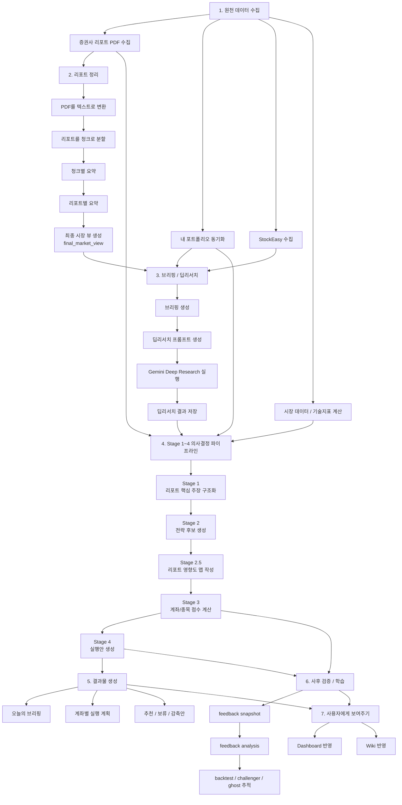
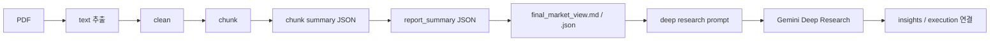

# EcoReport Pipeline Map

이 문서는 EcoReport의 작동 흐름을 "처음 보는 사람도 이해할 수 있게" 한글 설명과 Mermaid 다이어그램으로 정리한 지도입니다.

빠르게 이해하려면 아래 한 줄만 먼저 기억하면 됩니다.

- `수집 -> 정리 -> 딥리서치/전략 -> 점수 계산 -> 실행안 -> 피드백 -> 대시보드/위키`

## 1. 한눈에 보는 전체 흐름

## 2. 단계별 쉬운 설명

### 1) 원천 데이터 수집

여기서는 시스템이 판단에 필요한 재료를 모읍니다.

- 증권사 리포트 PDF
- 내 계좌와 보유 종목
- StockEasy 보조 데이터
- 시장 데이터와 기술지표

즉, 아직 "판단"이 아니라 "재료 준비" 단계입니다.

### 2) 리포트 정리

PDF를 그대로 LLM에 넣지 않고, 읽기 쉬운 구조로 쪼갭니다.

- PDF -> 텍스트 변환
- 텍스트 -> 청크 분할
- 청크별 요약
- 리포트별 요약
- 전체 시장 관점으로 다시 합친 `final_market_view`

이 단계의 목적은 "긴 PDF를 작은 근거 조각으로 바꾸는 것"입니다.

### 3) 브리핑 / 딥리서치

리포트 요약, 시장 뷰, StockEasy, 포트폴리오를 합쳐 브리핑과 딥리서치 재료를 만듭니다.

- 브리핑 생성
- Gemini Deep Research용 프롬프트 생성
- 웹에서 Deep Research 실행
- 결과 저장

이 단계는 "시장 맥락을 더 풍부하게 읽는 과정"입니다.

### 4) Stage 1~4 의사결정 파이프라인

EcoReport의 핵심 엔진입니다.

- Stage 1: 리포트에서 핵심 주장과 사실을 구조화
- Stage 2: 전략 후보 생성
- Stage 2.5: 어떤 리포트가 어떤 종목/계좌에 영향을 주는지 맵핑
- Stage 3: 종목/계좌 점수 계산
- Stage 4: 실제 행동 계획 생성

즉, "읽은 내용을 실제 투자 판단 구조로 번역"하는 단계입니다.

### 5) 결과물 생성

사용자가 바로 볼 수 있는 산출물을 만듭니다.

- 오늘의 브리핑
- 계좌별 실행 계획
- 매수 / 보류 / 감축 후보

### 6) 사후 검증 / 학습

결과가 실제로 맞았는지, 어떤 근거가 유효했는지 추적합니다.

- feedback snapshot
- feedback analysis
- challenger / ghost / backtest

이 단계 때문에 시스템이 점점 더 "복기 가능한 구조"가 됩니다.

### 7) 사용자에게 보여주기

최종적으로 같은 결과물을 여러 인터페이스가 읽습니다.

- Dashboard
- Wiki

즉, 별도 복사본을 만드는 게 아니라 같은 산출물을 다양한 뷰에서 보여줍니다.

## 3. 로컬 PDF LLM 파이프라인만 따로 보기

이 부분은 EcoReport 안에서도 특히 중요한 서브파이프라인입니다.

이 흐름의 핵심은 아래 두 가지입니다.

- 원문 PDF 전체를 한 번에 LLM에 넣지 않는다
- 중간 산출물을 계속 남겨서 사람과 기계가 모두 확인할 수 있게 한다

## 4. 실제 파일 기준으로 보면

| 단계 | 대표 산출물 |
|------|-------------|
| 리포트 수집 | `data/reports/YYYY-MM-DD/*` |
| 포트폴리오 | `data/portfolio/latest.json` |
| StockEasy | `data/stockeasy/YYYY-MM-DD/*` |
| 로컬 orchestrator 결과 | `reports/report_summaries/YYYY-MM-DD/*`, `reports/merged/final_market_view.md` |
| 브리핑 | `knowledge/daily/YYYY-MM-DD-briefing.md` |
| 딥리서치 | `knowledge/daily/YYYY-MM-DD-deepresearch.md` |
| Stage 1~4 | `data/analysis-state/YYYY-MM-DD/*` |
| 실행 계획 | `reports/daily/YYYY-MM-DD-stage4-execution-plan.md` |
| 피드백 | `data/feedback/*` |
| 대시보드 / 위키 | `dashboard/`, `knowledge/wiki/` |

## 5. 어디서 실행하나

대표 실행 진입점은 아래입니다.

- 전체 운영: `bash scripts/run-daily-system.sh --date YYYY-MM-DD`
- 자동화 러너: `npm run automation:daily -- --date YYYY-MM-DD`
- 로컬 PDF LLM: `bash scripts/run-local-report-orchestrator.sh --date YYYY-MM-DD`
- shadow 파이프라인: `npm run shadow:pipeline -- --date YYYY-MM-DD`

## 6. 같이 보면 좋은 문서

- [README.md](/Users/seo/Documents/Playground/economy-report/README.md)
- [docs/EXECUTION_GUIDE.md](/Users/seo/Documents/Playground/economy-report/docs/EXECUTION_GUIDE.md)
- [docs/STAGE_1_4_ARCHITECTURE.md](/Users/seo/Documents/Playground/economy-report/docs/STAGE_1_4_ARCHITECTURE.md)
- [docs/LOCAL_PDF_LLM_ORCHESTRATOR.md](/Users/seo/Documents/Playground/economy-report/docs/LOCAL_PDF_LLM_ORCHESTRATOR.md)
