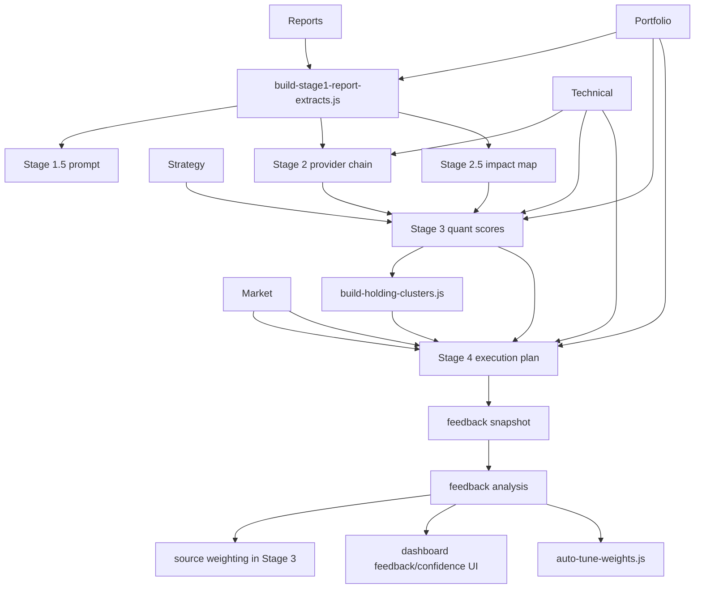

# EcoReport Architecture

이 문서는 현재 운영 중인 EcoReport 파이프라인을 코드 기준으로 설명합니다.

## 목표

EcoReport는 아래 흐름을 고정합니다.

1. 리포트와 시장 데이터를 구조화한다.
2. 전략 후보를 만든다.
3. 계좌/포지션 점수를 계산한다.
4. 실행안을 생성한다.
5. 결과를 피드백 데이터로 다시 학습한다.

즉 구조는 이제 `Stage 1~4`만이 아니라 `Feedback Loop`까지 포함해 읽어야 합니다.

## 상위 구조

## 공통 입력 계층

공통 입력은 `scripts/lib/analysis-context.js`와 `scripts/lib/pipeline-utils.js`를 중심으로 정리됩니다.

주요 입력:

- `data/portfolio/latest.json`
- `config/strategy.json`
- `config/watchlist.json`
- `data/technical/YYYY-MM-DD.json`
- `data/market/YYYY-MM-DD.json`
- `data/reports/YYYY-MM-DD/*`
- `data/analysis-state/YYYY-MM-DD/*`

## Stage별 역할

### Stage 1

스크립트:

- `scripts/build-stage1-report-extracts.js`

출력:

- `data/analysis-state/YYYY-MM-DD/stage1-report-extracts-v2.json`
- `knowledge/daily/YYYY-MM-DD-stage1-report-extracts-v2.md`

역할:

- PDF/텍스트 리포트를 구조화된 연구 노트로 변환
- 계좌/보유 종목과 연결 가능한 fact anchor 확보

### Stage 1.5 / 1.6

스크립트:

- `scripts/build-stage1-5-gemini-deep-research-prompt.js`
- `scripts/build-stage1-6-rich-briefing.js`

역할:

- 웹 기반 Deep Research 오버레이
- Stage 1 fact anchor를 유지한 채 리치 브리핑 생성

### Stage 2

스크립트:

- `scripts/build-stage2-strategy-prompt.js`
- `scripts/build-stage2-strategy-gemini.py`
- `scripts/build-stage2-strategy-claude.js`
- `scripts/build-stage2-strategy-mock.js`

기본 동작:

- `run-strategy-pipeline.sh`는 기본적으로 `Gemini -> Claude -> Mock` 폴백 체인을 사용
- `--mock-stage2`는 테스트용 고정 mock
- `--gemini-stage2`, `--claude-stage2`로 우선 공급자 지정 가능

출력:

- `data/analysis-state/YYYY-MM-DD/stage2-strategy-options.json`
- `data/analysis-state/YYYY-MM-DD/stage2-strategy-options.mock.json`
- `data/analysis-state/YYYY-MM-DD/stage2-run-log.json`

### Stage 2.5

스크립트:

- `scripts/build-impact-map.js`

출력:

- `data/analysis-state/YYYY-MM-DD/impact-map.json`

역할:

- Stage 1 리포트와 포트폴리오 영향도를 확정 레이어로 번역
- Stage 3/4가 직접 소비할 수 있는 영향 맵 제공

### Stage 3

스크립트:

- `scripts/build-stage3-quant-scores.js`

출력:

- `data/analysis-state/YYYY-MM-DD/stage3-quant-scores.json`

핵심 역할:

- factor / tech / report / regime / tax-aware 조정 반영
- 계좌별 총점과 포지션별 action score 계산
- `researchSourceAccuracy`가 있으면 source multiplier 반영

### Holding Clusters

스크립트:

- `scripts/fetch-historical-returns.py`
- `scripts/build-holding-clusters.js`

출력:

- `data/analysis-state/YYYY-MM-DD/holding-clusters.json`

역할:

- 최근 수익률 상관관계 기반 클러스터링
- 중복 포지션/집중도 경고를 Stage 4와 대시보드에 제공

### Stage 4

스크립트:

- `scripts/build-stage4-execution-plan.js`

출력:

- `data/analysis-state/YYYY-MM-DD/stage4-execution-plan.json`
- `reports/daily/YYYY-MM-DD-stage4-execution-plan.md`
- `reports/daily/YYYY-MM-DD-briefing.md`

핵심 역할:

- 계좌별 deploy budget / reserve cash 산출
- staged buy / hold / trim / watch 생성
- entry guardrail, stop loss note, validation flag 부여
- cluster warning 반영

## Feedback Loop

### Feedback Snapshot

스크립트:

- `scripts/build-feedback-snapshot.js`

출력:

- `data/feedback/snapshots/YYYY-MM-DD.json`

역할:

- 당일 Stage 3/4 상태를 고정
- 이후 실제 수익률과 비교 가능한 기준점 저장

### Feedback Analysis

스크립트:

- `scripts/build-feedback-analysis.js`

출력:

- `data/feedback/analysis/YYYY-MM-DD-feedback.json`
- `data/feedback/latest-feedback.json`
- `reports/feedback-summary.md`

포함 항목:

- 점수-수익률 상관관계
- BUY/HOLD/TRIM 적중률
- 팩터 예측력
- 레짐별 정확도
- 최악 오판
- 리서치 소스 정확도

### Auto Tune

스크립트:

- `scripts/auto-tune-weights.js`

출력:

- `config/strategy.json` 갱신
- `data/feedback/weight-history.jsonl`

보호 장치:

- `sampleSize < 20` 스킵
- 팩터별 최소 표본 수 조건
- 1회 최대 변화폭 제한
- 절대 하한/상한 적용
- `--dry-run` 지원

## 대시보드 연결

주요 파일:

- `dashboard/app/page.tsx`
- `dashboard/components/FeedbackPanel.tsx`
- `dashboard/components/AllocationHeatmap.tsx`
- `dashboard/components/ClusterMap.tsx`
- `dashboard/components/ExecutionListTable.tsx`
- `dashboard/components/ExperimentalUiProvider.tsx`

연결 원칙:

- 서버 측에서 파일 기반 JSON을 읽고 렌더링
- 대시보드는 분석 API를 새로 호출하지 않음
- 실험 UI는 글로벌 `테스트 UI` 토글로 전체 온오프

실험 UI 범위:

- 배분 히트맵
- 실행계획 신뢰도 뱃지
- 피드백 대시보드
- 상관관계 클러스터

## 현재 산출물 계층

### 날짜별 운영 상태

- `data/analysis-state/YYYY-MM-DD/*`

### 피드백 장기 추적

- `data/feedback/snapshots/*`
- `data/feedback/analysis/*`
- `data/feedback/weight-history.jsonl`

### 사용자 노출

- `dashboard/`
- `reports/daily/*`
- `knowledge/wiki/*`

## 문서 간 역할 분리

- 운영 절차: `docs/OPERATOR_RUNBOOK.md`
- 점수 모델 상세: `docs/SCORE_SYSTEM_V2.md`
- 실험/회귀: `docs/EXPERIMENT_PLAYBOOK.md`
