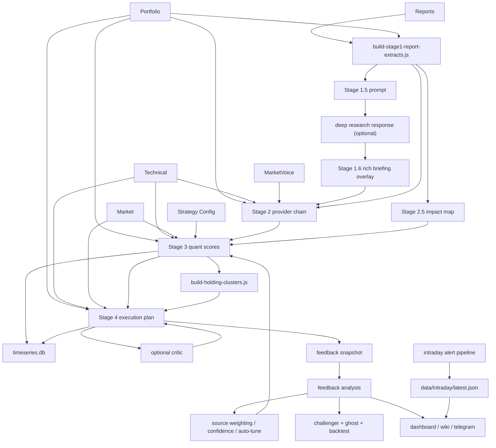

# EcoReport Architecture

이 문서는 현재 운영 중인 EcoReport 파이프라인을 코드 기준으로 설명합니다.

## 목표

EcoReport는 아래 흐름을 고정합니다.

1. 리포트와 시장 데이터를 fact anchor로 구조화한다.
2. 전략 후보를 만든다.
3. 계좌/포지션 점수를 계산한다.
4. 실행안을 생성한다.
5. 결과를 피드백 / challenger / ghost / backtest로 다시 검증한다.
6. 대시보드와 위키가 같은 산출물을 읽게 유지한다.

즉 구조는 `Stage 1~4`만이 아니라 `Ops + Storage + Feedback + Intraday`까지 포함해 읽어야 합니다.

## 상위 구조

## 실행 모드

### 1. Daily Master Runner

- `scripts/run-daily-system.sh`
- 수집, 시장/technical, RAG, optional Gemini briefing, Stage 1~4, wiki, verify, Telegram, ghost/challenger를 묶어 실행합니다.
- `--use-dag`로 DAG 러너를 선택할 수 있습니다.

### 2. Strategy Runner

- `scripts/run-strategy-pipeline.sh`
- Stage 중심 재실행에 적합합니다.

### 3. DAG Runner

- `scripts/run-pipeline-dag.js`
- `config/pipeline-manifest.yaml` 기반 위상 정렬, 부분 스킵, dry-run 보고서를 지원합니다.

### 4. Intraday Runner

- `scripts/run-intraday-alert-pipeline.js`
- 장중 경보, intraday overlay, dashboard 반영에 사용합니다.

## 공통 입력 계층

공통 입력은 `scripts/lib/analysis-context.js`와 `scripts/lib/pipeline-utils.js`를 중심으로 정리됩니다.

주요 입력:

- `data/portfolio/latest.json`
- `config/strategy.json`
- `config/watchlist.json`
- `config/stage-contracts.json`
- `config/pipeline-manifest.yaml`
- `config/alerts.json`
- `config/telegram.json`
- `data/technical/YYYY-MM-DD.json`
- `data/market/YYYY-MM-DD.json`
- `data/reports/YYYY-MM-DD/*`
- `data/analysis-state/YYYY-MM-DD/*`
- `data/intraday/latest.json`
- `data/timeseries.db`

## Stage별 역할

### Stage 1

스크립트:

- `scripts/build-stage1-report-extracts.js`

출력:

- `data/analysis-state/YYYY-MM-DD/stage1-report-extracts-v2.json`
- `knowledge/daily/YYYY-MM-DD-stage1-report-extracts-v2.md`

역할:

- PDF/텍스트 리포트를 구조화된 연구 노트로 변환
- 계좌/보유 종목과 연결 가능한 fact anchor 확보
- `_contract` 메타데이터 포함

### Stage 1.4 Full Daily Report / Insight Atoms

스크립트:

- `scripts/build-stage1-4-full-daily-report.py`
- `scripts/collectors/summarize-report-chunks.py`
- `scripts/build-stage1-4-research-agenda.py`

출력:

- `data/analysis-state/YYYY-MM-DD/stage1-4-full-daily-report.json`
- `data/analysis-state/YYYY-MM-DD/stage1-4-full-daily-report.md`
- `data/analysis-state/YYYY-MM-DD/stage1-4-insight-atoms.json`
- `knowledge/daily/YYYY-MM-DD-full-daily-report.md`

역할:

- `reports/report_summaries/YYYY-MM-DD/report_*.json` 전체를 source of truth로 사용합니다.
- 해당 날짜의 리포트별 요약을 top-N으로 자르지 않고 모두 읽어 카테고리별 통합 리포트와 일자 통합 리포트를 생성합니다.
- report별 `insight atom`을 병렬로 추출해 신규 후보, 소수 의견, 리스크, 촉매, 포트폴리오 관련 아이디어를 구조화합니다.
- 기존 `summarize-report-chunks.py`의 top-N 출력은 Deep Research agenda 생성을 위한 보조 입력이며, 일자 통합 리포트의 기준 데이터로 쓰지 않습니다.

### Stage 1.5 / 1.6

스크립트:

- `scripts/build-stage1-5-gemini-deep-research-prompt.js`
- `scripts/build-stage1-6-rich-briefing.js`

출력:

- `knowledge/daily/manual-kit/YYYY-MM-DD/07-stage1-5-gemini-deep-research-prompt.md`
- `knowledge/daily/manual-kit/YYYY-MM-DD/09-stage1-5-gemini-deep-research-response.md`
- `knowledge/daily/YYYY-MM-DD-gemini-briefing-rich.md`

역할:

- 웹 기반 Deep Research 오버레이
- Stage 1 fact anchor를 유지한 채 리치 브리핑 생성
- 반복 테마, 강조 extract, refinement 결과를 하나의 briefing으로 병합
- 최신 기준으로 숫자/조건/반론 anchor 보존을 강화

### Stage 2

스크립트:

- `scripts/build-stage2-strategy-prompt.js`
- `scripts/build-stage2-strategy-qwen.py`

기본 동작:

- `run-strategy-pipeline.sh`는 Qwen Stage 2를 실행하고 실패 시 즉시 중단
- `--mock-stage2`는 비활성화되어 있으며 운영 데이터 생성에 사용할 수 없음
- `--gemini-stage2`는 레거시 alias로만 남아 있고 실제로는 Qwen 경로를 사용

출력:

- `data/analysis-state/YYYY-MM-DD/stage2-strategy-options.json`
- `data/analysis-state/YYYY-MM-DD/stage2-run-log.json`

입력 맥락:

- Stage 1 추출물 + 포트폴리오 스냅샷 + 기술 점수 subset
- `rich briefing`, refinement 메모, follow-up Deep Research 응답까지 함께 참고
- direct/macro extract를 evidence card 형태로 전달
- fidelity 검증은 `scripts/validate-briefing-fidelity.js`

### Stage 2.5

스크립트:

- `scripts/build-impact-map.js`

출력:

- `data/analysis-state/YYYY-MM-DD/impact-map.json`

역할:

- Stage 1 리포트와 포트폴리오 영향도를 확정 레이어로 번역
- Stage 3/4가 직접 소비할 수 있는 영향 맵 제공
- extract id와 stage3/stage4 근거 연결을 유지

### Stage 3

스크립트:

- `scripts/build-stage3-quant-scores.js`

출력:

- `data/analysis-state/YYYY-MM-DD/stage3-quant-scores.json`

추가 출력/저장:

- `data/timeseries.db`의 `stage3_positions`, `portfolio_snapshots`

핵심 역할:

- factor / tech / report / regime / tax-aware 조정 반영
- 계좌별 총점과 포지션별 action score 계산
- `researchSourceAccuracy`가 있으면 source multiplier 반영
- `scoreDecomposition` 포함
- contract metadata 포함

### Holding Clusters

스크립트:

- `scripts/fetch-historical-returns.py`
- `scripts/build-holding-clusters.js`

출력:

- `data/analysis-state/YYYY-MM-DD/holding-clusters.json`

역할:

- 최근 수익률 상관관계 기반 클러스터링
- 중복 포지션/집중도 경고를 Stage 4와 대시보드에 제공

### Stage 4

스크립트:

- `scripts/build-stage4-execution-plan.js`

출력:

- `data/analysis-state/YYYY-MM-DD/stage4-execution-plan.json`
- `reports/daily/YYYY-MM-DD-stage4-execution-plan.md`
- `reports/daily/YYYY-MM-DD-briefing.md`

핵심 역할:

- 계좌별 deploy budget / reserve cash 산출
- staged buy / hold / trim / watch 생성
- entry guardrail, stop loss note, validation flag 부여
- cluster warning 반영
- optional critic review 병합 지원
- `data/timeseries.db`의 `stage4_plans`, `portfolio_snapshots` 적재
- contract metadata 포함

### Intraday Overlay

스크립트:

- `scripts/fetch-market-data-lite.js`
- `scripts/evaluate-alert-triggers.js`
- `scripts/recompute-stage3-intraday.js`
- `scripts/run-intraday-alert-pipeline.js`

출력:

- `data/intraday/YYYY-MM-DD/market-lite.json`
- `data/intraday/YYYY-MM-DD/emergency-alerts.json`
- `data/intraday/latest.json`
- `data/analysis-state/YYYY-MM-DD/stage3-intraday-updates.json`

역할:

- 10분 단위 경량 감시
- 장중 급변 시 Telegram 긴급 알림
- canonical Stage 3 전체 재생성 대신 intraday overlay 제공

## Feedback Loop

### Feedback Snapshot

스크립트:

- `scripts/build-feedback-snapshot.js`

출력:

- `data/feedback/snapshots/YYYY-MM-DD.json`

역할:

- 당일 Stage 3/4 상태를 고정
- 이후 실제 수익률과 비교 가능한 기준점 저장

### Feedback Analysis

스크립트:

- `scripts/build-feedback-analysis.js`

출력:

- `data/feedback/analysis/YYYY-MM-DD-feedback.json`
- `data/feedback/latest-feedback.json`
- `reports/feedback-summary.md`

포함 항목:

- 점수-수익률 상관관계
- BUY/HOLD/TRIM 적중률
- 팩터 예측력
- 레짐별 정확도
- 최악 오판
- 리서치 소스 정확도

### Auto Tune

스크립트:

- `scripts/auto-tune-weights.js`
- `scripts/auto-tune-challenger.js`
- `scripts/backtest-challenger.js`
- `scripts/build-ghost-portfolio.js`
- `scripts/backtest-engine.js`

출력:

- `config/strategy.json` 갱신
- `data/feedback/weight-history.jsonl`
- `data/feedback/challenger-weights.json`
- `data/feedback/challenger-backtest.json`
- `data/feedback/ghost-portfolio.jsonl`
- `data/backtest/engine-latest.json`

보호 장치:

- `sampleSize < 20` 스킵
- 팩터별 최소 표본 수 조건
- 1회 최대 변화폭 제한
- 절대 하한/상한 적용
- `--dry-run` 지원

## Foundation & Ops 계층

### Contract / Validation

- `config/stage-contracts.json`
- `scripts/validate-stage-contracts.js`

역할:

- Stage 산출물 필수 키 규격화
- `_contract.version`, `stage`, `generatedAt` 보장

### Telegram / Alerting

- `config/telegram.json`
- `scripts/send-telegram-summary.js`

역할:

- 일일 파이프라인 요약 알림
- KIS sync 실패 알림
- intraday 긴급 알림

### SQLite Time-Series

- `scripts/lib/timeseries-db.js`
- `data/timeseries.db`

역할:

- Stage 3/4 JSON 이중화
- 백테스트 / 시계열 조회 기반

### Rebalancing / Scheduling

- `scripts/build-rebalancing-schedule.js`

역할:

- 월초 / 레짐 전환 시 리밸런싱 제안
- 계좌별 tax-aware sell priority 메모 생성

## 대시보드 연결

주요 파일:

- `dashboard/app/page.tsx`
- `dashboard/app/api/intraday/route.ts`
- `dashboard/app/lib/data-loader.ts`
- `dashboard/app/components/IntradayAutoRefresh.tsx`
- `dashboard/app/components/IntradayAlertBanner.tsx`
- `dashboard/app/components/EvidenceChain.tsx`
- `dashboard/app/components/ScoreBreakdownPanel.tsx`
- `dashboard/app/components/GhostPortfolio.tsx`
- `dashboard/app/components/BacktestSummary.tsx`
- `dashboard/components/FeedbackPanel.tsx`
- `dashboard/components/AllocationHeatmap.tsx`
- `dashboard/components/ClusterMap.tsx`
- `dashboard/components/ExecutionListTable.tsx`
- `dashboard/components/ExperimentalUiProvider.tsx`

연결 원칙:

- 서버 측에서 파일 기반 JSON을 읽고 렌더링
- 장중 상태만 얇은 polling API를 사용
- 실험 UI는 글로벌 `테스트 UI` 토글로 전체 온오프

실험 UI 범위:

- 배분 히트맵
- 실행계획 신뢰도 뱃지
- 피드백 대시보드
- 상관관계 클러스터
- simulator route
- evidence / decomposition / ghost / backtest 보조 패널

## 현재 산출물 계층

### 날짜별 운영 상태

- `data/analysis-state/YYYY-MM-DD/*`
- `data/intraday/*`

### 피드백 장기 추적

- `data/feedback/snapshots/*`
- `data/feedback/analysis/*`
- `data/feedback/weight-history.jsonl`
- `data/feedback/challenger-weights.json`
- `data/feedback/challenger-backtest.json`
- `data/feedback/ghost-portfolio.jsonl`
- `data/backtest/engine-latest.json`
- `data/timeseries.db`

### 사용자 노출

- `dashboard/`
- `reports/daily/*`
- `knowledge/wiki/*`

## 문서 간 역할 분리

- 저장소 구조: `docs/REPO_STRUCTURE.md`
- 운영 절차: `docs/OPERATOR_RUNBOOK.md`
- 점수 모델 상세: `docs/SCORE_SYSTEM_V2.md`
- 실험/회귀: `docs/EXPERIMENT_PLAYBOOK.md`
