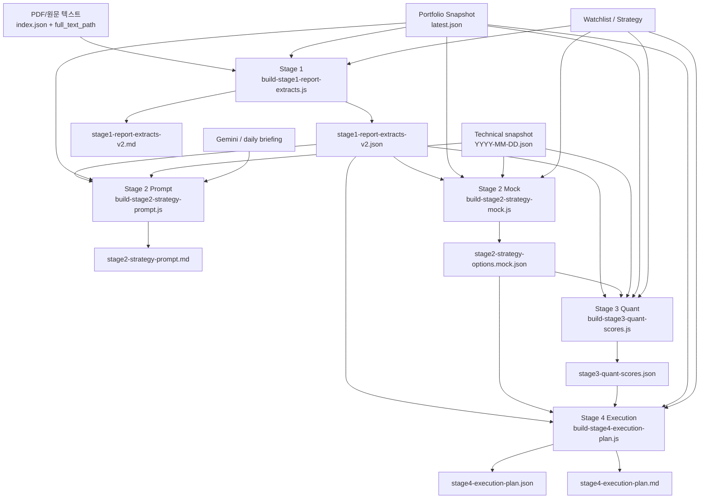

# EcoReport Stage 1-4 Architecture

## Goal

EcoReport를 다음 4단계 구조로 고정합니다.

1. `Stage 1` 리포트 연구 노트화
2. `Stage 2` 전략 탐색 LLM
3. `Stage 3` 퀀트 점수화
4. `Stage 4` 실행 계획 생성

`igzun-daily-report`는 참고용으로만 보고, 실제 구현은 EcoReport 안에 독립적으로 유지합니다.

## Architecture

## Output Contract

### Stage 1

- `data/analysis-state/YYYY-MM-DD/stage1-report-extracts-v2.json`
- `knowledge/daily/YYYY-MM-DD-stage1-report-extracts-v2.md`

핵심 필드:

- `report_type`
- `sector`
- `themes`
- `related_holdings_in_my_portfolio`
- `related_accounts`
- `key_thesis`
- `key_points`
- `key_numbers`
- `bull_case`
- `bear_case`
- `portfolio_impacts_candidate`
- `evidence_notes`

### Stage 2

- `knowledge/daily/manual-kit/YYYY-MM-DD/08-stage2-strategy-prompt.md`
- `data/analysis-state/YYYY-MM-DD/stage2-strategy-options.mock.json`

실제 LLM을 붙이면 mock JSON 대신 동일 스키마의 실제 응답 JSON을 저장합니다.

### Stage 3

- `data/analysis-state/YYYY-MM-DD/stage3-quant-scores.json`

핵심 필드:

- `regime`
- `holdings.*.actionScore`
- `holdings.*.direction`
- `holdings.*.timing`
- `holdings.*.reportScore`
- `holdings.*.probabilities`
- `accounts.*.totalScore`
- `portfolio.totalScore`

### Stage 4

- `data/analysis-state/YYYY-MM-DD/stage4-execution-plan.json`
- `reports/daily/YYYY-MM-DD-stage4-execution-plan.md`

핵심 필드:

- `deployBudget`
- `reserveCash`
- `topGap`
- `stagedBuys`
- `trims`
- `holds`
- `watches`
- `stage1Drivers`

## Why this split works

### Stage 1

리포트를 바로 “추천”하지 않고, 연구 노트 형태로 보존합니다.

### Stage 2

강한 해석과 전략 수정은 LLM이 맡되, 입력 컨텍스트와 출력 스키마는 EcoReport가 통제합니다.

### Stage 3

최종 점수와 확률은 규칙/퀀트 엔진이 계산합니다.  
이 단계는 재현성과 추적성을 담당합니다.

### Stage 4

실제 실행 금액과 계좌별 행동 지침은 1~3단계 결과를 모두 사용합니다.
